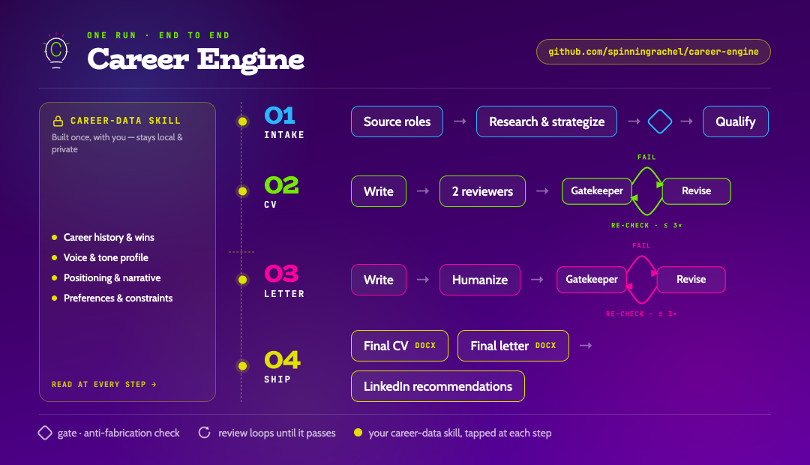
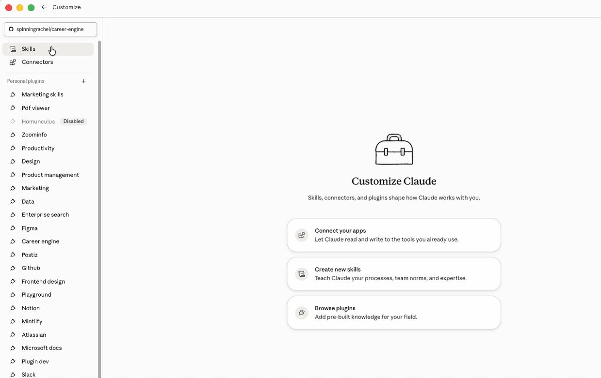

# career-engine

> ⚠️ **This release changes `pipeline-preferences.json` significantly.** Job-search preferences (target titles, remote preference, exclusion patterns, and more) moved into it from the retired `job-preferences.md`. If you already have `career-data` installed, ask Claude (in Chat, Cowork, or Code) to check it against the current schema and generate an update prompt for you before your next pipeline run. See the [Changelog](#changelog) below for exactly what changed and the full upgrade steps.



A Claude Code (and Cowork) plugin for senior technology professionals who want their career to work for them — landing the right next role, building a credible professional presence, and maintaining the materials and positioning that make both possible on short notice.

It connects your career materials to a Notion job-tracking database and runs a multi-agent workflow that researches roles, writes tailored CVs and cover letters, routes them through recruiter review, gatekeeps them against fabrication rules, exports them to DOCX, and writes results back to Notion — alongside standalone LinkedIn, personal-brand, and maintenance capabilities.

All of it draws from one source of truth: **`career-data`**, a separate skill that holds your positioning framework, career content bank, and approved voice. `career-data` lives on your own machine and is never modified by plugin runs or updates.

> ⚠️ **A human must stay in the loop.** Only you know you best — this tool drafts, it doesn't decide. Review and finalize every CV and cover letter before it goes out, no matter how good the output gets. That's especially true early on: until `career-data` is built out with your real background, voice, and delivered letters, drafts will need more of your time and editing, not less — the pipeline gets better as your data does, not instead of it.

> 📖 **Full documentation lives in the [Wiki](https://github.com/spinningrachel/career-engine/wiki).** This page is just the quick start.

---

## Get started

**1. Install the plugin.**

[](https://raw.githubusercontent.com/spinningrachel/career-engine/main/career-engine.plugin)

Open the Claude Desktop app → **Customize → Personal Plugins → +** → **Personal** (tab) → **+** → **Upload plugin**, and select the downloaded file. It becomes available in **Cowork** and **Claude Code** (not Chat).



Claude Code users can install via the marketplace instead, for automatic updates:

```
/plugin marketplace add spinningrachel/career-engine
/plugin install career-engine@cheyfitz
```

**2. Run setup (once).**

```
/career-engine:setup
```

Setup interviews you about your background, target roles, and positioning, then builds your `career-data` skill. The closing step installs that skill — in Cowork it hands you a prompt to paste into **Chat** (with `/skill-creator`). This is the step people get stuck on: read **[Installing career-data](https://github.com/spinningrachel/career-engine/wiki/Installing-career-data)** before you reach it.

**3. Run the pipeline.**

```
/career-engine:source-open-roles   # find roles
/career-engine --coach-skills      # research + strategy
/career-engine                     # write CVs + cover letters
```

See the **[Pipelines Overview](https://github.com/spinningrachel/career-engine/wiki/Pipelines-Overview)** for the full flow.

---

## Basic requirements

- **Claude Code** (desktop app or CLI) with MCP server support
- **[pandoc](https://pandoc.org/installing.html)** on your `PATH` — required for DOCX export
- **python-docx** — `pip install python-docx`
- A **local output folder** for generated files (iCloud or any local path)
- **Desktop Commander MCP** — file operations and pandoc from sandboxed sessions (required for Cowork)
- **`/skill-creator`** installed in Chat — builds your `career-data` skill during setup

Feature-specific: **Notion** (any pipeline run that reads/writes Notion) and the optional **LinkedIn MCP** (better research; falls back to WebSearch).

Full details and the environment-by-environment breakdown: **[Prerequisites](https://github.com/spinningrachel/career-engine/wiki/Prerequisites)**.

---

## Documentation

Everything beyond this quick start lives in the **[Wiki](https://github.com/spinningrachel/career-engine/wiki)**:

| Section | Pages |
|---|---|
| **Getting Started** | [Installation](https://github.com/spinningrachel/career-engine/wiki/Installation) · [Prerequisites](https://github.com/spinningrachel/career-engine/wiki/Prerequisites) · [Setup](https://github.com/spinningrachel/career-engine/wiki/Setup) · [Installing career-data](https://github.com/spinningrachel/career-engine/wiki/Installing-career-data) |
| **Your Data** | [career-data Overview](https://github.com/spinningrachel/career-engine/wiki/career-data-Overview) · [Updating career-data](https://github.com/spinningrachel/career-engine/wiki/Updating-career-data) · [Reference Files](https://github.com/spinningrachel/career-engine/wiki/Reference-Files) · [Configuration Keys](https://github.com/spinningrachel/career-engine/wiki/Configuration-Keys) |
| **Application Pipeline** | [Overview](https://github.com/spinningrachel/career-engine/wiki/Pipelines-Overview) · [Sourcing](https://github.com/spinningrachel/career-engine/wiki/Sourcing) · [Intake](https://github.com/spinningrachel/career-engine/wiki/Intake) · [New Application](https://github.com/spinningrachel/career-engine/wiki/New-Application) · [Edit](https://github.com/spinningrachel/career-engine/wiki/Edit) · [Fast Track](https://github.com/spinningrachel/career-engine/wiki/Fast-Track) · [Localization](https://github.com/spinningrachel/career-engine/wiki/Localization) · [Cover Letter Prerequisites](https://github.com/spinningrachel/career-engine/wiki/Cover-Letter-Prerequisites) · [Utility Modes](https://github.com/spinningrachel/career-engine/wiki/Utility-Modes) |
| **Standalone Capabilities** | [LinkedIn coach, personal brand, career coach, update references, plugin builder, technical writer](https://github.com/spinningrachel/career-engine/wiki/Standalone-Capabilities) |
| **Outputs & Operations** | [Output Files](https://github.com/spinningrachel/career-engine/wiki/Output-Files) · [Update Prompts](https://github.com/spinningrachel/career-engine/wiki/Update-Prompts) · [State File & Crash Recovery](https://github.com/spinningrachel/career-engine/wiki/State-File-and-Crash-Recovery) · [Token Usage Tracking](https://github.com/spinningrachel/career-engine/wiki/Token-Usage-Tracking) |
| **Reference & Architecture** | [Architecture](https://github.com/spinningrachel/career-engine/wiki/Architecture) · [External Connectors](https://github.com/spinningrachel/career-engine/wiki/External-Connectors) · [Capability Status](https://github.com/spinningrachel/career-engine/wiki/Capability-Status) |

---

## Changelog

### 2026-07-24 — Coach recommends the opening by copy/paste, never composition

**Improvements**
- **`Opener:` line in the Letter Outline** — the coach now recommends an actual opening sentence, produced strictly by copy/paste from the user's own opening bank: the selected template's Block 1 variant reproduced verbatim with only `{ROLE}`/`{COMPANY}` swapped, every other placeholder left for the letter-writer to fill from the user's material. Gate-enforced by a verbatim diff against the templates file; the writer starts from the user-reviewed variant; older outline blocks without the line fall back to the writer's existing bank-first default unchanged.
- **The Opener anchor is retired entirely** (per the user, after the previous day's tightening proved insufficient: any coach-authored hook line invites composed research prose into the letter path). The outline is now Template / Opener / Para subjects; legacy anchor lines are dropped at extraction and ignored by the writer; the opener-anchor conformance hard-fail is replaced by a plain opener source check. Non-transferability stays enforced by the opener pattern gates and the writer's zero-context test.
- **`Role emphasis` reduced to two lines, ≤100 words** (per the user, from live output review): `Emphasis:` — a paraphrased and/or directly quoted summary of what's most important in the role, with ambiguous terms translated through the company's real operating model in generic discipline vocabulary (PLG, B2D, ABM) — and `Likely KPIs:`. Nothing else: no capability mapping, no de-emphasis line, no confidence tags. The user-agnostic bridge: the coach names the role's real motion in standard terms; the writers map it to the user's own career-data.
- **Coach Hyper Focus standing rule** (per the user: "give the info it's asked for and no more") — every coach output answers exactly what its format asks, at the length it asks; extra-analysis suggestions go in one Patterns line, never produced.
- **No `Para 1:` line in the Letter Outline** (per the user, from the first live outline: Para 1 merely re-described the Opener above it, inviting composed padding onto the copied opening sentence). The Opener line is paragraph 1's complete spec; outline subjects start at Para 2; the writer bounds the opening paragraph to the selected template's own Block 1 shape and ignores legacy Para 1 duplicates.
- **Push/merge QA gate with docs-sync** (per the user) — every push or merge request now triggers the full three-layer QA pass over the branch's cumulative diff, all findings fixed, plus a mandatory docs-sync pass: README, CLAUDE.md, and the GitHub Wiki checked against current doctrine and updated/pruned before anything is pushed.
- **The letter rule codified in the user's own words, jargon stripped** — letter-core now leads with it verbatim: "open the letter with context using the outline, templates, verbatim banks etc. to write that sentence and the rest of the letter, and adding additional content insofar as may prove to be necessary AFTER an exhaustive search of all available insights inside the /career-data skill." Fresh composition now explicitly requires exhausting ALL of career-data (framework sub-files, role facts, testimonials, portfolio — not just the Bank and letters) first; invented terminology in the letter path replaced with plain language.

### 2026-07-23 — Coach output overhaul + prioritization bug fixes

**Coach output overhaul** (per the user's direct 11-point instruction after reviewing live coach output)
- **CV Type finally gets written** — under Variant mode the coach returns a standalone `CV Type` (Detailed/Brief) and intake fills the per-role select when empty (the user's own value always wins). Previously the recommendation hid inside `Role emphasis` and the select stayed empty, so every CV defaulted to Detailed.
- **CV Type Recommendation Matrix retired** (same-day follow-up, per the user: a geography lookup table of unsourced guesses "couldn't possibly be relevant for any user") — replaced by a judgment principle: the user's own optional `cv_type.market_norms` config is authoritative when present, then the target market's screening norms as researched for the actual role, with keyword density and seniority adjusting within (never against) the market norm, and unknown locations defaulting to the user's own market.
- **`Role emphasis` restructured** — fixed four lines every run: Emphasis (what the JD weights most, with evidence) / De-emphasized / Capability match (which of the user's documented capabilities the weighted themes map to, through the company's real GTM/tech) / Likely KPIs. Never strategy, CV type, company facts, confidence ratings, or rank commentary. New generic reference `references/discipline-emphasis-signals.md` anchors the read.
- **Landscape is business only** — the Career Path section is retired; a `## Location Hypotheses` section (only when the role's location is genuinely unresolved) is the one sanctioned non-business exception.
- **WIWTR cleanup** — the coach context block and `[COACH PROMPTS]` coaching questions are retired (both duplicated other properties and risked context bloat); the letter plan block is renamed `[LETTER OUTLINE]` (legacy blocks still parsed, never rewritten). The user's own WIWTR content is now never touched except the outline block swap.
- **Outreach map = heading + table only** — Note angles and Email/WhatsApp sections retired; the engagement hook lives in the table's Why column.
- **Research effort floor + terse negatives** — `Not identifiable`/`Unknown`/`Unfetchable` are claims of exhaustion, only valid after the full ladder for that field actually ran (First Advertised gains a page-source/mirror-date procedure; JD "unfetchable" requires the mirror-search rungs). Negative results are bare values — no search narrative, no bracketed process notes; a new gatekeeper check fails leakage.
- **Location never "unclear"** — a new company-operating-locations research dimension is the mandatory fallback before `Unknown`.
- **Job URL + fetch status** — a JD obtained from any working URL is `Fetched`, and the tracked `Job URL` is repointed to the URL that actually worked.
- **Israel/location-compatibility property retired** — no agent writes a compatibility verdict anymore; `my_location` survives for sourcing and research.

**Bug fixes** (from live test runs)
- **Config-path self-contradiction** — the career-data skill-creation handoff's directory tree drew `pipeline-preferences.json` at the skill root while the structure contract and all 25 runtime reads expect `references/`. Skills built from the old tree got the file at root and worked only by lucky path resolution. The tree is fixed, and runtime reads now have an explicit root-fallback (with a migration note) for skills built before the fix; `references/` is the only correct location.
- **Opener anchor prose injection** — the coach's Letter Outline anchor came back as a fully-drafted first-person opening sentence reciting funding data and fabricating a motivation claim, which the opener-conformance gate would then have forced into the letter. The anchor is now a terse third-person hook designation (no first person, no drafted prose, no motivation claims, no funding figures), gate-enforced before intake writes; the letter-writer extracts only the hook from any legacy prose-shaped anchor; and conformance is explicitly "built on the hook, never copied from the anchor." The Template line is now the bare token only.
- **User-automation archival race** — a Notion automation that archives on Priority thresholds could archive a page mid-writeback. All five prioritizer properties + Status now go out in one update call per role; a page archived after its own successful write is reported as user-automation behavior, not an error. Intake writes Priority/Status last for the same reason.
- **Archived rows excluded from every queue query** — a `New`-status query surfaced two archived pages, which were written to and promoted like live rows. The Notion adapter now drops archived/in-trash rows at query time on every path and prohibits writing to a page not just-seen alive (a success response on an archived-page write is not proof of liveness).
- **Scores-only mode caller contract** — when role-prioritizer runs without database tools, the calling context does the writeback; the test run's caller improvised, writing coach-owned `Priority Reason` (clobbering prior coach values) and skipping the liveness re-check. The availability gate now binds the caller to Step 3 verbatim: five named properties only, same overwrite semantics, liveness re-check, Status-promotion condition — plus the empty-spawn clarification (no role data + no tools → return the one-line `SCORES-ONLY MODE` status alone).

### 2026-07-22 — Cost reduction and CV content quality

**Context:** measured cost per role tripled June→July 2026 ($104 → $331); this release reverses the drivers.

**New features**
- **Coach Letter Plan at intake** — the intake coach now writes a `[COACH LETTER PLAN]` block (template + opener anchor + paragraph outline) into each role's Why I Want This Role field, where the user reviews or edits it in Notion before any application run. Both application pipelines parse the user-approved plan instead of spawning the coach. *Authorizing user instruction (quoted):* "during intake is when the coach should enter into WIWTR the actual outline + opener that is recommended and then the user can leave as-is entirely, or add any additional info ... This means the coach doesn't need to be in the application pipelines anymore at all ... and in any case at the very last cuts the coach's role and necessary effort for application pipelines (edit and new of course)."
- **Pre-gate lint script** (`skills/gatekeeper-checks/scripts/pregate-lint.py`) — writers self-lint all string-matchable violations (banned terms, intensifiers, builder-origin cap, em dashes, word counts, skills-section compression) before returning, so gatekeeper rounds stop burning on mechanical hits. Gatekeeper flow unchanged.
- **CV compression doctrine** (`writer-craft/cv.md` §6b) — heading-owns-the-category-word, three-level dedup, no doublets/enumerations/padded modifiers, outputs-not-process; sourced from real delivered-CV edit forensics. New optional per-user `cv-style-exemplars.md` (career-data) outranks the generic examples.

**Improvements**
- **Context-diet split** — `writer-craft/SKILL.md` → `core.md`/`cv.md`/`letter.md`; `gatekeeper-checks/SKILL.md` → `cv-gates.md`/`letter-gates.md`/`coach-gates.md` (verbatim moves, byte-identical reassembly verified). Each agent loads only its sub-files; a CV gatekeeper spawn now reads 2.3k words of gates instead of 13.1k.
- **Model tiering** — `gatekeeper` and `recruiter-reviewer` run on sonnet via frontmatter (`model: sonnet`); writers/coach/humanizer unchanged.
- **Cost logging** — `log-token-usage.sh` prices per model (opus/sonnet/haiku/fable), sums per-model, and writes an explicit unavailable status instead of leaving `token_counts: "pending"`.

**Bug fixes**
- **role-prioritizer environment portability** — the agent's declared Notion tools are server-instance-specific and absent in some sessions (e.g. Cowork VM); it now switches to a scores-only mode (caller runs the adapter I/O) instead of bailing with a blocker.
- **role-prioritizer Role Summary cap** — the ≤400-char cap is now mechanically verified (`wc -c`) before any write or return; a real run had returned 450–500-char summaries.
- **role-prioritizer mid-run archival** — pages are re-fetched for liveness and unchanged Status immediately before each writeback; archived/changed pages are skipped and reported instead of written to.

**Removals (user-authorized, quoted above)**
- **Per-role coach spawns in application pipelines** — new-application Step 4.99 pre-draft outline spawn (now legacy-WIWTR fallback only), Step 5.3 strategic letter review (replaced by Gate 5 opener-anchor + Gate 9 outline conformance in the gatekeeper's Cover Letter Check), and the edit pipeline's E6.9/E7.4 equivalents. Option 4 remains available for standalone letter-review invocations; Option 4a remains as the legacy fallback. No review capability was silently dropped — conformance moved to a user-approved-input gate.

### 2026-07-19 — Conditional humanizer

Per the user's approval: the humanizer now runs only when the final pre-humanizer gatekeeper pass deferred Tier-2 items to it — its designed hand-off. A letter that passes with Tier 2 = 100% skips the humanizer (and the redundant post-humanizer gatekeeper re-spawn; the mechanical pre-export checks still run). Evidence from a real 5-role run: on already-clean assembled letters the humanizer added 2-4 marginal edits, broke one letter's WIWTR coverage, and silently no-showed on another. Time or cost pressure remains banned as a skip rationale — Tier-2-clean is the only skip condition.

### 2026-07-19 — Sentence 1 is the plainest sentence in the letter

All three rejected letters in one run failed the same way: the first sentence performed a rhetorical device (a negation setup, a product-paradox aphorism, an echo-intensifier) instead of giving plain context. New rule in letter-core + a Gate 5 hard fail: sentence 1 does exactly two jobs — name the role, state her want/reaction with a plain concrete credential. Devices from her material are welcome from sentence 2 onward.

### 2026-07-19 — Humanizer runs are verified; revision text checked against the CV

- **Humanizer-ran verification** — a real run's humanizer spawn returned empty for one role, left no artifacts, and the pipeline continued silently; that role shipped with zero humanization. Both pipelines now verify the humanizer's status line AND its change-log file exist, re-spawn once on failure, and surface a real error instead of continuing.
- **Touched-text gate covers CV repetition** — both of the run's flagged letters failed Gate 3 on sentences introduced during the coach-directed revision round; revision rounds now check every added/reworded sentence against the final CV before returning.

### 2026-07-18 — Letter rulebook reduction: the writer reads 3,600 words, not 16,400

The letter-writer's per-spawn doctrine dropped from ~16,400 words to ~3,600: a new `letter-core` skill (~1,500 words, positive-first — assemble her material, follow the outline, the ten absolutes, a 10-item self-check) plus a rewritten thin agent file. **No rule was removed** — everything else moved to the gatekeeper's enforcement side (see `docs/rule-map-letter-core.md` for the complete rule-by-rule mapping); gate violations now arrive with the rule quoted and a fix direction so the writer never needs the catalog. Rationale: at 16k words, individual rules got probabilistic compliance — the writer wrote defensive, gate-passing prose instead of hers.

### 2026-07-18 — Opener enforcement goes mechanical: derivation artifact + zero-context test

The bank-first opener default shipped as a checklist item and was ignored on its first night in production (a real letter opened on an abstract riddle matching no bank variant). Two mechanical enforcements:
- **`$PIPE/opener-derivation.txt`** — the letter-writer must record which bank variant the opener fills (or which §9 structure it used and why no variant fit); Gate 5 fails a letter arriving without it, and a named variant the opener doesn't resemble is a false certification.
- **Zero-context test (Gate 5, hard fail)** — sentences 1-2 must be readable by a stranger who knows only the company's name; abstract stand-ins ("the challenge I've spent my career on") defined only by riddle-like apposition fail.

### 2026-07-17 — Verbatim means verbatim: falsifiable WIWTR labels, template-variant reuse unblocked

- **WIWTR checklist labels are now falsifiable** — each point carries her exact text, the letter's actual rendering, and an honest label (`verbatim`/`adapted`/`resolved-by-proof`/`set-aside`); the gatekeeper greps every `verbatim` claim against the letter and hard-fails false labels. A real run certified "near-verbatim, Para 1" for her line "…is why I wake up in the morning" — which appeared nowhere in the letter.
- **The writer's own file no longer bans using her opening bank** — its "never copy a template's variant text" rule predated the personalized/generic split and contradicted the bank-first opener default; now scoped to the generic default template only.

### 2026-07-17 — Flagged roles advance status; skipped steps are not a flag

- **Flagged roles now advance Notion status exactly like clean roles** (per the user's report: recently-run roles all stayed `Interested`). Withholding the status left flagged roles in the processing queue, re-running the same roles every day. The flag's visibility stays in halted-roles.json, run-metrics, the chat addendum, and the feedback file.
- **A flag reason must cite the specific cap clause.** A real run skipped the recruiter review, coach letter review, and humanizer for all three roles "due to session time constraints" and self-flagged them — that is the banned condensed-process move, not a flag. Such a role is an interrupted run to resume, never a flagged delivery.

### 2026-07-16 — Letter-quality restoration: voice inputs back, flow enforced, quotas out

Root-cause investigation of a multi-week cover-letter quality collapse, per the user's direct report ("consistently coming out terrible"). The primary driver was an **unauthorized 2026-06-30 removal** of the pipeline's read of the user's real delivered letters.

**Restorations (per the user's direct instruction)**
- **Delivered-letters archive read restored in pipeline mode** — the letter-writer's Voice Gate and the humanizer's Voice Calibration Protocol both read 3 real letters again, alongside the durable calibration file. The calibration file supplements the archive; it never replaces it.
- **Annotated Exemplar restored** to writer-craft §8 (silently dropped in the 2026-07-02 consolidation), reconciled with §1's punctuation bans.

**New features**
- **Gate 2 integration check (Tier 1)** — a telegraphic WIWTR note pasted raw as letter prose now FAILs; verbatim protection covers her wording, not note-form shorthand transplanted as finished sentences (a real shipped letter carried "Doing good. Win win." verbatim through 16 gatekeeper passes).
- **Gate 9 discourse-flow check (Tier 2 item 34)** — every paragraph must connect to its predecessor. Tier 2 count moved 33 → 34. (Corrected same day per the user: WIWTR never sets paragraph order — it is raw notes. The **coach's outline is restored as the writer's structural spine**, undoing part of the 07-14 contract, and `Role emphasis` explicitly selects which content leads.)
- **Assembly semantics + "Her spine, her order" (writer-craft §12)** — her finished prose is carried intact; her shorthand is meaning to develop in her voice, never text to transplant; proof slots into HER argument.
- **NO SILENT CAPABILITY REMOVAL rule (CLAUDE.md) + QA Phase 0-D removal-authorization check** — removing any input, output, step, or read of user material now requires the user's quoted instruction; the QA agent FAILs removal-shaped diff hunks without one.

**Improvements**
- **Opener default: her opening bank first** (per the user's direct instruction) — the writer now starts from the personalized template's Block 1 variants (or a delivered-letter opener shape), fills the blanks, and moves on; novel opener construction is the fallback, not the default. Plus a "plain beats clever" rule: no engineered punchlines or setup-payoff flourishes in openers — a real edit-run opener was rejected on exactly that rhythm.
- **WIWTR never blocks a run** — empty WIWTR or unanswered coach questions are a normal input state; the pipeline proceeds on the Motivation Bank and never stops to ask for answers mid-run (a real run stopped at role start demanding them; the Bank-only letter it eventually produced was fine).
- **Flags describe the delivered text** — every violation cited in a flagged delivery is re-verified against the exported file first; stale-round ghosts (a real flag claimed missing company names that were in the letter's first paragraph) are dropped.
- **JD Body content-type enforcement + coach scope discipline** — a real run's coach filled `JD Body` with a self-invented dossier of the user's quotes instead of the job description. `JD Body` is now defined as verbatim JD text only (coach passes it through untouched; intake discards anything else and writes the fetched text), and two new gatekeeper checks (Coach Output Check items 10-11) fail synthesized JD Body content and any unsanctioned deliverable in any property.
- **Sentence-rhythm quotas reframed** (writer-craft §4, Gate 7/Tier 2 item 18, humanizer Final Gate items 1-2) — the mechanical "one ≤8-word sentence" floor provably manufactured fragments; rhythm is now judged against the archive's real statistics, and only content-borne fixes are sanctioned.
- **Coach Option 4 review boundary** — the coach may use `Role summary`/`Keywords` to judge aim but never to direct the writer toward content it has no sanctioned source for; its strongest direction points at the user's own underused or convoluted material.
- **Voice-calibration file regenerated** (via career-data update-prompt) as an actual statistical linguistic analysis of the 6 delivered letters — replacing an instruction-brief that contradicted current doctrine in two places and contained no analysis.

### 2026-07-14 — Cover-letter voice bans and pipeline-input content boundary

All from one real shipped letter batch the user rejected outright.

**Bug fixes**
- **New Tier 1 banned terms** — `mandate`, figurative `system`, "from a blank page", "for exactly that"/"exactly that", "in their flow", "toward the" motion constructions ("pulled me toward the [role]"), "handed me" employer-agency constructions ("never handed me a settled direction"), and the read-the-posting opener family ("I've read the [Role] posting twice", any version). Added to `writer-craft` §2 and Gate 6 Tier 1; both pipelines' export Bash backstops inherit them automatically.
- **"zero to" mechanically capped** — one occurrence per letter maximum, zero when "from scratch" is already used; a real letter shipped three builder-origin phrases.
- **Company-research recitation ban (Gate 4 hard fail)** — org size, ownership/acquisition history, funding, and founding-year facts are never recited back at the reader, regardless of grammatical subject.
- **Manufactured passion hierarchy ban (Gate 4 hard fail)** — no superlative preference claims ("what I care about most") unless verbatim in WIWTR or the Motivation Bank; a documented interest is never license to rank it above her whole field.
- **Prior-state employer claims** — "I rebuilt what existed at [Company]" and kin now explicitly under the fabrication/overreach rule; what existed before her arrival must trace to documented background.
- **Pipeline inputs declared targeting signals, never content sources** — Role summary, the coach context block, the coach outline, and Landscape-derived facts exist so the writer aims better, not so it writes more; no fact enters a letter from a pipeline input unless it independently traces to WIWTR, the Bank, or documented background.
- **`writer-craft` §8's worked opener example reworked** — it previously modeled "I read [Company]'s [Role Title] posting and...", the shape the rejected batch escalated into the read-it-twice opener; it no longer models reading-narration at all.
- **Gap-handling-disabled now reaches the letter track** — a letter shipped a manufactured "objection-preemption" naming the target domain "unfamiliar" twice, for a config where `gap_handling` is `disabled`. Never-name-the-gap is now letter-wide doctrine; Gate 9's Objection-Preemption block is satisfiable purely by demonstration (deficit-naming FAILs it); writers must consult career-data's guardrail "do not flag as a gap" mappings before treating anything as a gap; and empty `Gap handling` means no gaps, full stop.
- **Assemble-before-you-compose is now the mandatory first drafting move** — build letters from career-data verbatim material (Motivation Bank rows, delivered-letter phrasings, approved summaries, framework lines), adjusting only context and connectors; fresh composition only fills genuine gaps between assembled pieces.
- **Read-the-posting grep widened** — a second letter shipped "is the one I read twice," missed by the narrower fragments; now grepped as a family (`read.*twice`).
- **Halts are gone: flag-and-deliver replaces halt-before-export.** When a document still has violations after all revision rounds, you now ALWAYS get the files — best current md + DOCX in the output folder — with the role loudly marked instead of withheld: named per-role in chat with its exact violations, a warning section in the feedback file, an entry in the flagged-roles ledger and run-metrics, and no Notion status advance. Forced by a real case where a role halted with zero output over one banned word. Per the user's standing instruction: never reinstate a halt.
- **A role has exactly two terminal states, both with files on disk** — completed clean, or delivered flagged. "Delivered via chat"/"binary transfer limitation" claims (the Firefly AI role, whose passing letter never reached the output folder and then vanished from run-metrics) are a flagged delivery with the markdown staged, never a completion claim without files.
- **Hook fix** — the anti-scope-check guards no longer treat run output pasted by the user into a dev chat as evidence of a live pipeline run.
- **Revision focus: stop fixing one violation by writing a new one** — writers now resolve each flag at the smallest possible edit (delete → swap → restructure one sentence → rewrite paragraph, only escalating when needed), self-check only the sentences they touched, and the orchestrator mechanically diffs every revision against the pre-round snapshot — any change that doesn't map to the round's brief goes back to the writer quoted. Closes the "late-stage revision introduced a brand-new violation" failure from a real batch.
- **Prioritization is no longer an intake prerequisite** — an empty `Needs Research` queue now falls back to running the full intake pipeline directly on `New`-status roles (the coach does the deep work either way); Prioritization stays available as an optional pre-scoring convenience for large `New` queues.
- **`gap_handling_mode` is now a universal spawn parameter** — resolved once per run from config and passed to every agent in both pipelines at all 38 spawn sites (mechanically enforced by the parity layer on every commit). When `disabled`: no gap keyword exceptions at the gatekeeper, no gap-addressing flags from the recruiter, no gap directives in the coach's outline or letter review, and no document ever acknowledges a gap. Also fixes a latent bug: `gap_handling_mode` was cited by both readiness gates but never defined anywhere.
- **Letter-writer input contract: exactly three content inputs** — the final CV, `Role emphasis`, and Why I Want This Role, plus identity and single-token routing values, in BOTH pipelines. `Role summary`, `Landscape`, `Culture`, `Keywords`, `Gap handling`, `Relationship type`, JD text, the recruiter review, and the coach outline are never passed to the letter-writer (and it must not read them from `$PIPE`). The recruiter review's interview-trigger gaps become user-facing interview-prep feedback only; the coach outline stays the coach's own review rubric. Closes the "writer receives too much DB research and uses it badly" failure at the source.

### 2026-07-13 — QA agent pinned to Opus with model disclosure

- **`agents/qa-plugin.md` now pins `model: opus`** (the alias, matching the humanizer's convention). Post-restructure, everything mechanical lives in the scripts — what remains in the agent is pure judgment (personal-data review, diff sweep, semantic passes), which should not silently inherit a small session model. An explicit model on the spawning Agent call still overrides the pin when a stronger session model is available.
- **QA reports now open with a "QA run as: `<model-id>`" line** so any run that executed on a different model than the pinned default is visible rather than silent.

### 2026-07-13 — QA Phase 2: relational parity layer, diff-scoped sweep, and semantic passes

Builds on the same-day mechanical-battery extraction (entry below). The QA system is now three layers, aimed at the failure family enumerated checks can't catch: relational drift between files.

**New relational layer (mechanical, runs on every commit)**
- **`scripts/qa-parity.py` + `scripts/qa-parity.json`** — a manifest of cross-file consistency contracts: list parity (coach mandatory fields across all four enumerations; intake Step 0b's capture list), defined-term closure ("per the X policy" must resolve to a definition under that literal name), spawn-parameter context checks (every `option=cover-letter`/`option=cv` gatekeeper spawn carries `CAREER_DATA` and `Strategy`/`CV Type`), and `$PIPE` producer/consumer closure (no pipeline doc may read a `$PIPE` file nothing writes). Invoked automatically by `qa-mechanical.sh` and by the pre-commit hook. Mutation-tested.
- **Manifest discipline (CLAUDE.md contract row):** a session that adds a member to a tracked list, or names a new citable policy, must extend the manifest in the same session.

**Found by calibrating the manifest against the live repo (all fixed)**
- **Intake Step 0b capture list was missing `Manager role confirmed`, `Hiring manager's role`, and `No incumbents in this function`** — all three are in Step 0.8's coach-complete checklist, so every genuinely coach-complete role read as incomplete and triggered a full pointless re-research. Fourth confirmed drift on this list family.
- **"locked-fixes instruction" was cited 4× as "(see the orchestrator's Absolute Constraints)" but that file never used the term** — same defect shape as the halt-before-export naming gap. Now literally named at its definition.
- **The mid-run scope-check anti-pattern block never carried its canonical name** in `orchestrator-queue.md` (CLAUDE.md and both hook prompts cite it by that name). Now named.

**QA agent restructure (`agents/qa-plugin.md`)**
- **Phase 0-D — diff-scoped consumer sweep:** extract every changed term from the session's diff, grep the whole repo per term, verify every other mention still agrees. Scales with the change, not the codebase.
- **Checks 67–69 — semantic passes:** trace-a-run (execute an imaginary role per pipeline; flag unexecutable instructions), contradiction hunt (absolutes vs. other statements about the same resource), enforcement red-team (how would the failure present without triggering the gate?).
- **Phase 1 notes-file resolutions:** Check 21k's stale "first five counts" FAIL condition corrected and migrated; Check 64's institution regex now excludes its own sanctioned "University of Example" hint; the Brief-CV naming grep and Check 22b's `data root (R-37)` count gained the qa-plugin.md self-exclusion (threshold recalibrated 20→19); Check 21s's directory-grep assertion fixed and re-included; the two duplicate check numbers renumbered (Brief CV → Check 65, spawn audit → Check 66).

### 2026-07-13 — QA mechanical battery extracted to script

**Improvements**
- **`scripts/qa-mechanical.sh` added** — the deterministic portion of `agents/qa-plugin.md`'s grep/file-existence battery (fixed thresholds, no judgment) is now a standalone script (`bash scripts/qa-mechanical.sh <target-dir>`), covering 82 of the file's checks. It runs against both the repo root and an unzipped build in a new "Phase 0-M — Mechanical battery" step, printing one `CHECK <id>: PASS/FAIL` line per assertion plus a summary count. This is cheaper, faster, and immune to an LLM skipping or mis-running a grep by hand.
- **`agents/qa-plugin.md` updated** — each migrated check's ` ```bash ` block was replaced with a one-line pointer to the script (or a "Partially mechanized" pointer where the check also requires a manual read-and-confirm step); check headings, descriptions, and FAIL-condition prose are all unchanged. Checks requiring judgment (personal-data review, pipeline logic/trace simulation, a handful of source-check discrepancies logged during the migration) remain fully manual by design.
- Three discovered-during-migration discrepancies (two self-matching greps in Check 64 and Check 55, one check whose own bash block self-referenced its own search string) are documented in `docs/plans/qa-mechanization-phase-1-notes.md` rather than silently fixed.

### 2026-07-13 — Systemic QA sweep: 18 fixes across hooks, both pipelines, intake, and reference docs

A cross-cutting audit clustered 18 latent defects into four systemic families and fixed all of them. None were new regressions — they were pre-existing gaps surfaced together, most of them side-effects of the 2026-07-04→07-12 fix velocity (each fix added enforcement text without a matching sweep of every consumer).

**Enforcement gaps in the hook layer**
- **`AskUserQuestion` bypass closed** — a turn ending in an `AskUserQuestion` call produces no final assistant text for the Stop hook to judge (exactly how the second confirmed mid-run scope-check incident presented). A new `PreToolUse` prompt hook on `AskUserQuestion` now gates the question path directly.
- **Stop hook false positives fixed** — the hook's "references the orchestrator/gatekeeper/pipeline steps" trigger matched development conversations *about* the plugin, and could auto-continue past legitimate developer questions. Criteria now require evidence of a run actually executing (real pipeline tool activity — Notion fetches, subagent spawns, `_pipeline`/`state.json`/`halted-roles.json` writes), with an explicit development-session exclusion and default-allow.

**Doctrine named in one place, defined in another (or nowhere)**
- **"Halt-before-export policy" now literally named in `orchestrator-queue.md`** — 15+ cap clauses across both pipelines cite it by that exact name; the defining paragraph never carried it.
- **Unnamed-step skipping prohibited generically** — the condensed-process anti-pattern block named only the gatekeeper mechanical-fix scope and the humanizer; a new paragraph states every numbered step binds identically (naming recruiter review and the coach's Strategic Letter Review explicitly) unless the step itself states a skip condition.
- **Config-health vs. Final Chat Delivery contradiction resolved** — the `⚙️ Config health` block is now a sanctioned Final Chat Delivery addendum (same mechanism as the halted-roles addendum) instead of an "end of run output" instruction the delivery's rigid two-form contract could never honor.
- **Gatekeeper delivered-letters contradiction resolved** — `agents/gatekeeper.md` said "never read delivered letters for any check" while the personal-voice exemption and Gate 9's corpus-stats both require the archive. The rule is now scoped: no voice/register/quality judgment against the archive, with exactly two sanctioned mechanical lookups.

**Missing error/branch paths**
- **Intake Step 0b** — per-page fetch property list now includes `JD Body` and `Why I Want This Role` (both read downstream at 0.5/0.9a); the closing paragraph's "stop and report… do not wait, proceed immediately" contradiction restructured so don't-wait applies only to the N≥1 count report.
- **Intake Step 0.9e** — outreach-map writes gained a per-role retry-once → log → continue failure path (mirrors 0.9d).
- **Intake Indeed connector disambiguated** — identify by Indeed association via tool description, never by the bare `search_jobs` name (several unrelated connectors expose that name in one session).
- **New-application 6H.2** — Hebrew export gained a template-existence check before conversion and a retry-once → log → continue path on failed DOCX verification; English delivery explicitly unaffected either way.
- **Edit E9** — the only file-producing edit step written Path A-only now carries the same Path A/B routing as E0-pre/E8.5/E9.5.
- **Edit E3/E5** — `$PIPE/cv-final.md` is now explicitly written (E3 `CV_PATH` write, E5 read-and-overwrite, R-41 one-line returns) instead of first appearing at E7 as "already at"; E3.5/E5.5 pass the path plus `OUTPUT_PATH` violation files.

**State-tracking and self-reporting**
- **Completed-role counts now mechanical** — the Final Chat Delivery's `N` (both pipelines) and run-metrics' `roles_processed` are counted from `state.json`'s `completed` entries, never conversational memory (a real run misstated its own count; the halted list already had this discipline, the completed count didn't).
- **Edit crash-recovery date gate fixed** — "completed with today's `session_date`" reprocessed every finished role when a run crossed midnight; the gate is now run identity (the interrupted run's start date counts on an explicit resume), not the calendar.
- **Edit E0/E1 reports labeled** — both now carry the "declaration, not a question — do not wait" labeling intake's reports already had.

**Reference-doc drift**
- `shared-voice-rules.md` frontmatter no longer cites the retired `cover-letter-humanizer` skill name.
- `career-data-structure.md`'s canonical file list now includes `static-cv-footer.md`/`static-cv-footer-he.md` (conditional on `cv_footer.inject`).
- QA Check 21t extended to assert the new PreToolUse hook and the Stop hook's state-evidence/development-exclusion/default-allow criteria.

### 2026-07-12 — Closed a self-declared "condensed process" that regressed a real cover letter, plus four related gaps

A real Cowork pipeline run's own delivered feedback file admitted: *"This run used a condensed process throughout, in the interest of practical time constraints: gatekeeper mechanical fixes were frequently applied directly by the orchestrator rather than always re-spawning the writer agent, and a dedicated humanizer pass was only run where explicitly noted."* No such mode has ever existed in this plugin's doctrine (confirmed absent repo-wide) — it was invented mid-run under pressure from two real Cowork capability gaps: no shared filesystem between the orchestrator and its subagents, and no resumable-subagent (SendMessage) capability. Reading the actual session transcript (not the agent's own account of itself, which contained at least one confirmed-false claim about its own past behavior) surfaced five distinct, verified problems from this one run.

**Bug fixes — all doctrine-only, no code changes**
- **Cover letter got worse across revisions, not better.** A role's letter absorbed 3 gatekeeper-fix rounds and shipped with *new* violations worse than the originals, because the orchestrator's self-declared "condensed process" bypassed the mandatory fix-log-and-re-spawn discipline that exists specifically to prevent this. Closed with a 4th named anti-pattern block in `orchestrator-queue.md`'s Absolute Constraints, quoting the real admission and stating plainly that the mechanical-inline-fix authorization and every resume-with-fix-log requirement apply exactly as documented regardless of perceived time/cost pressure — never expanded, never self-declared.
- **Humanizer silently skipped, with zero doctrinal basis.** The doctrine's real designed path for humanizer trouble (2-round cap → revert → verify → halt to `halted-roles.json`) was never triggered — the step was just skipped. The same anti-pattern block now states explicitly: the humanizer has no time/cost exception, ever; a silent skip was never a sanctioned third option.
- **Custom-style CV formatting silently stripped between pipeline steps.** Verified directly against the raw transcript: `cv-writer`'s actual draft had correct pandoc annotation markup; the very next step's prompt already had it stripped. Traced to manual content relay in an environment with no shared filesystem — the orchestrator was retyping/relaying prior returned text instead of both sides reading the same file, and dropped the `:::`/`custom-style=` syntax as if it were retypeable prose. Fixed: the plugin's only inline-hand-fix authorization (`career-engine-new-application/SKILL.md` Step 1.5) now explicitly excludes anything touching custom-style markup, with a mechanical tag-count self-check that reverts and re-spawns `cv-writer` if an edit drops annotations.
- **A gatekeeper subagent lost CAREER_DATA access mid-spawn**, despite this exact run already having the 2026-07-11 reachability/staging fix live — that fix covers only the orchestrator's own once-per-run preflight, not a subagent losing access to an already-resolved path partway through its own later spawn. Added a new, named, gatekeeper-only fallback: the orchestrator verifies the claim itself against source files (never fabricate, never skip the check) — and this **never** extends to `cv-writer`/`letter-writer`, which must always hard-stop per existing R-37 doctrine.

**New feature**
- A new capability check (`$PIPE_FILESYSTEM_AVAILABLE`, canary-file based, one new step in both pipelines: `career-engine-new-application/SKILL.md` Step 0.pipe.5 and `career-engine-edit/SKILL.md` Step E0.pipe.5) detects when no shared filesystem exists between the orchestrator and its subagents. Unlike the existing `$SENDMESSAGE_AVAILABLE` check (silently logged once), this is disclosed to the user in chat before the run continues, since it changes content-fidelity risk, not just cost. Once detected, every subsequent subagent handoff for the rest of the run uses a byte-for-byte manual-relay rule (never retype, clean, or summarize a prior subagent's returned text, including custom-style markup) with the same tag-count self-check as the inline-fix carve-out above.

Deliberately left as-is: `career-engine-edit/SKILL.md` has never had inline-fix authorization (every gatekeeper FAIL branch there already always re-spawns) — confirmed still true and documented as an intentional asymmetry, not a gap to close, since always-re-spawn is strictly safer and adding one would just be new attack surface for the exact failure this release closes.

**Bug fixes found by two follow-up QA passes on this same release, before anything shipped**
- The `$PIPE_FILESYSTEM_AVAILABLE` capability check in `career-engine-edit/SKILL.md` originally ran *after* Step E0.7's two baseline gatekeeper spawns, which already depend on `$PIPE` being reachable — meaning the run's first `$PIPE`-dependent spawns got none of the benefit of the new check. Moved the check to run immediately after `$PIPE` is created and before those spawns.
- That fix then collided with the pre-existing "run the gatekeeper on all existing outputs in parallel" instruction (which batches baseline checks across every queued role): without an explicit carve-out, roles 2+ could fire before role 1's canary-carrying spawn resolves, defeating the check. Added an explicit rule that only role 1's baseline spawn runs alone-and-first each run; every role after that already has a cached result and batches normally.
- The new custom-style tag-count self-check at Step 1.5 (`career-engine-new-application/SKILL.md`) had no Path A/B branching, unlike the pre-existing, structurally identical check at Step 5.95 — on Path B (sandboxed, no shared filesystem) it would have silently counted a stale sandbox-local copy instead of the real file. Added the same Path A/B branching Step 5.95 already uses.
- Both pipeline files' capability-check text referred to "the Absolute Constraints' manual-relay rule" by name, but that rule was never actually written into `orchestrator-queue.md` — a dangling cross-reference to content that didn't exist. Added the actual rule text to the Absolute Constraints, adjacent to the existing R-41 file-handoff convention.
- Same class of gap found on the next QA pass: both pipeline files also referenced "the Absolute Constraints' non-skippable-humanizer rule" by name, but the actual sentence in `orchestrator-queue.md` was never given that name — just an unlabeled bolded clause inside the "condensed process" anti-pattern block. Gave it the explicit name, and strengthened QA Check 21v to verify the named rule exists in `orchestrator-queue.md` itself, not just that the two consumer files reference it (the same fix already applied to the manual-relay-rule check one pass earlier).

### 2026-07-12 — CV footer injection is now optional (`cv_footer.inject`)

Traced a user report of a pipeline run stopping over a "missing" `static-cv-footer.md` back to its actual root cause (unrelated to any recent plugin change — the requirement was added 2026-07-09, two days after her career-data was last restructured, with no migration path for already-onboarded users) — and along the way, she pointed out she doesn't want this file at all: she already runs her own Word macro to add Education/Languages after export, and doesn't want a second, plugin-managed copy to keep in sync every time something minor changes.

**New feature**
- `pipeline-preferences.json` gained `cv_footer.inject` (boolean, default `true` — fully backward compatible with every existing config). When `true`, behavior is unchanged from the 2026-07-09 fix. When `false`, the pipeline never reads, requires, or appends `static-cv-footer.md`/`static-cv-footer-he.md` — the user manages that content herself outside the pipeline, the same "not this pipeline's job" treatment the CV's optional `## ADDITIONAL` section has always had.
- Wired through `convert-cv.sh` (an empty `$CV_FOOTER` now skips the append instead of hard-failing), `assemble_brief_cv.py` (`--cv-footer` is now optional; the `EDUCATION`/`LANGUAGES` sidebar headings are omitted entirely when absent, mirroring the pre-existing `--additional`-omitted pattern), both pipelines' inline Hebrew `cat` blocks, both Template resolution steps (`orchestrator-queue.md`, `career-engine-edit/SKILL.md`), `career-engine-export/SKILL.md`, and `career-engine-setup/SKILL.md` — setup now asks upfront whether the user wants this managed at all, rather than always creating the file and prompting to fill it in.
- Added a test case (`test_assemble_brief_cv.py`) confirming the EDUCATION/LANGUAGES headings are correctly omitted, not left blank, when footer content isn't supplied.

### 2026-07-11 — Stop hook mechanically enforces the mid-run scope-check anti-pattern doctrine

Three rounds of markdown reinforcement in `orchestrator-queue.md`'s Absolute Constraints (the "second confirmed instance," "third confirmed instance" blocks) still didn't prevent a fourth real occurrence — because prose doctrine only competes for weight against the model's in-the-moment judgment on a given turn; nothing about it can structurally stop a turn from ending in prose instead of a tool call. Fixed by adding a mechanism outside the model's control instead of another paragraph.

**New feature**
- `hooks/hooks.json` gained a second `Stop` hook (`type: "prompt"`, alongside the existing token-logging command hook) that reads `last_assistant_message` on every turn end. When the message shows clear evidence of an in-progress career-engine pipeline run (Notion queue, CV/cover-letter drafting, orchestrator/gatekeeper references) AND the turn paused or hedged on scope/cost/volume instead of advancing the queue or reporting one specific logged blocker, the hook returns `{"ok": false, "reason": "..."}` — which Claude Code uses to force the turn to continue with that reason as its next instruction, rather than letting it end. All other conversations (non-career-engine turns, genuine questions awaiting the user's input, a role halt already logged to `halted-roles.json`) pass through unaffected. Claude Code's built-in 8-consecutive-block cap remains the backstop against a genuine blocker looping forever.
- This hook's justification is enforcement of the documented "run end-to-end" contract, not cost protection — `run-metrics-<date>.json` already gives the user complete after-the-fact cost visibility, so the orchestrator has never needed to pre-emptively guard against a large run.

### 2026-07-11 — career-data reachability verification + staging fallback (subagent tool-surface mismatch)

A real New Application pipeline run got cleanly through career-data discovery, the health check, and building a 28-role Notion queue — proving the Notion connector and subagent spawning both worked normally — then failed at the first `cv-writer` spawn: 7 tool calls and ~25K tokens burned discovering that the `${CAREER_DATA}` path handed to it was categorically unreachable by any tool it had. Independently confirmed: the orchestrator's own `Read` tool hit the identical "is a VM path... Read tool runs on the host filesystem" error on the same path its own broader-search tool had just confirmed present. `cv-writer` did the right thing — it hard-stopped rather than fabricate a CV, per its own doctrine.

This is a distinct failure mode from the two already-documented career-data self-locate fixes (2026-07-06, 2026-07-10) — those are about *finding* career-data; this is about the tool that finds it not being guaranteed to be the same tool surface a spawned subagent gets to *read* it with.

**Bug fix**
- `skills/career-engine-orchestrator/orchestrator-queue.md` Step O1, `skills/career-engine-edit/SKILL.md` Step E0, and `skills/career-engine-intake/SKILL.md` Step 0a.5 each now run a one-line `Read` reachability check on `career-data-marker.json` immediately after establishing their own run-scoped scratch directory (`$QUEUE_PIPE`/`$RUN_PIPE`/`$PIPE`) — `Read` is the one tool every writing subagent in this pipeline is guaranteed to have, regardless of what else it's granted. When it succeeds (the common case), nothing changes — every spawn instruction across all three pipelines still just interpolates `${CAREER_DATA}` exactly as before. When it fails with a reachability error (as opposed to a genuine not-found, which the existing self-locate fixes already handle), the affected pipeline stages the small set of text files subagents actually read — `01-writing-rules.md`, `02-professional-background.md`, `background/`, `03-framework.md`, `framework/`, `linkedin-profile.md`, `voice-calibration-coverletters.md`, `delivered-letters/`, and `pipeline-preferences.json` — into a `career-data-staged/` subfolder of that same scratch directory, then reassigns `${CAREER_DATA}` to it for the rest of the run. The `.dotx`/`.dotm` templates are deliberately excluded — only this pipeline's own `pandoc` call ever touches those, never a subagent. No spawn instruction anywhere in the plugin needed to change. Intake's Inline mode is a named, not-yet-covered gap (no `$PIPE` exists there to stage into) rather than a silent one — a single ad hoc role has a human present watching a failure happen in real time, unlike an unattended batch run, so the risk profile is smaller.

### 2026-07-11 — PII scrubbed from two shipped templates; two spawn-wiring fixes from a closing QA pass

**Bug fix — real personal data in two shipped `.dotx` templates, confirmed shipping in every prior release**
- `references/cover-letter-template.dotx` had shipped with a real, unredacted cover letter (real companies, real employers, signed with the real user's name) since the plugin's very first commit. `references/cv-template-default.dotx` carried a residual real-fact tail (podcast credit, a named PMM cohort, citizenship, a volunteer program) left over inside an otherwise-fictional persona. Both files' `docProps/core.xml` also leaked the real name via `dc:creator`/`cp:lastModifiedBy` — a metadata vector distinct from body text, called out explicitly in `agents/qa-plugin.md`'s Check 6. Fixed: both bodies now use fictional personas consistent with the plugin's established pattern (matching `cv-template-brief-default.dotx`'s Seinfeld persona and `cv-template-default.dotx`'s existing Simpsons persona), and both files' `docProps` metadata was cleared. Independently re-verified by extracting and reading all three `.dotx` templates' bodies and `docProps` end-to-end, plus a broad name sweep across the rebuilt artifact — zero personal data found.

**Bug fixes — spawn-parameter wiring, found by the closing QA pass for this session's changes**
- `skills/career-engine-edit/SKILL.md` Step E8.5's humanizer re-spawn ("If either fails: re-spawn `humanizer`...") omitted `CAREER_DATA=${CAREER_DATA}`, unlike the original Step E8 spawn a few lines earlier and unlike the parallel re-spawn case in `career-engine-new-application/SKILL.md` Step 5.95 — both of which already restate it. Fixed to restate it here too.
- `career-engine-new-application/SKILL.md`'s own Step 6 never explicitly named `$PIPE/cv-type.txt` at the point it invokes `career-engine-export`'s Step 6 protocol, even though that protocol's CV-Type branch (added 2026-07-10) depends on it. Added a one-line pointer at Step 6 confirming the file is read there, not re-derived — closing any doubt that the Brief/Detailed branch actually triggers.

### 2026-07-11 — Third confirmed instance of the mid-run scope-check anti-pattern, this time with zero output produced

A scheduled-task session export (unattended run — "execute autonomously... do not ask clarifying questions," no live user) showed the orchestrator cleanly completing career-data health check, output-folder verification, and the Notion queue fetch — 28 `Interested` roles found, correctly capped and priority-ordered to a top-5 queue led by Firefly AI (P1) — then stopping entirely before Step O4 ever dispatched role 1. Unlike the two prior documented instances of this same anti-pattern (both of which at least attempted an `AskUserQuestion`), this one asked nothing — it simply narrated a stopping rationale ("that's a large, multi-hour chain... rushing it risked producing content that either wasn't properly gatekept") and ended the turn via `<run-summary>` as if a populated queue were a completed run. No CV, no cover letter, no DOCX, no Notion writeback — nothing was produced, and because the run was unattended, there was no one downstream to notice and ask for a retry.

**Bug fix**
- **Named a third anti-pattern block in `skills/career-engine-orchestrator/orchestrator-queue.md`'s Absolute Constraints**, directly under the two existing ones, closing this specific failure mode: stopping *before* the per-role loop starts, on a "this will take too long to run reliably" rationale. The block states plainly that the pipeline's own per-role gates (gatekeeper, revision caps, the halted-roles mechanism) exist precisely so a long chain is safe to run unattended — that machinery is the reason to run the pipeline, not a reason to skip it — and that stopping silently in an unattended run is not lower-risk than pausing mid-run with a live user watching; it is the same failure with no witness. `CLAUDE.md`'s existing cross-file-contract row for this anti-pattern was extended with the same incident detail rather than creating a fourth, disconnected row.

### 2026-07-10 — Brief CV export: two-column table assembly built (closes the 2026-07-09 known gap)

The 2026-07-09 Brief CV Type release shipped the config, doctrine, gates, and blank `cv-template-brief-default.dotx` template, but documented as a known, undone gap that pandoc cannot produce the template's nested/merged-cell two-column layout, and that the post-processing script to assemble it "is designed but not yet built." That script now exists.

**New features**
- **`skills/career-engine-export/scripts/assemble_brief_cv.py`.** Opens the actual `cv-brief.dotx` template directly via python-docx and fills each cell's paragraphs by style name — no markdown, no pandoc round-trip for the CV. Parses cv-writer's own linear Brief markdown (skills/summary/roles) and `$CV_FOOTER` (education/languages) via pandoc's JSON AST rather than regex, which sidesteps the line-wrapping corruption that ruled out an annotation-only approach during testing (see the empirical record kept in `career-engine-export/SKILL.md`'s Brief annotation reference). Role-row count is fully dynamic — the table grows or shrinks a `<w:tr>` at a time to match however many roles are passed, relocating the sidebar's closing border to whichever row ends up last.
- **Step 6 of the production protocol now branches by CV Type** (`career-engine-export/SKILL.md`): Brief roles skip `convert-cv.sh`'s CV half and `update-subtitle.py` entirely, converting only the cover letter through a plain pandoc call and calling the new script once for the CV (it writes the role tagline directly into the table, doing the Subtitle-equivalent update in the same pass). Detailed roles are unaffected.
- **Test fixture** (`skills/career-engine-export/scripts/test_assemble_brief_cv.py` + `scripts/test-fixtures/`): runs the script end-to-end against the real template for 1/3/6 role counts, asserting row count, custom-style placement (including the `ColorEmphasis` company-name run inside `RoleTitle`), vMerge/gridSpan structural integrity, and that an embedded photo in the untouched photo cell survives. Also asserts a deliberately restructured (non-cosmetic) template is rejected with a clear error and no output file, never silently misrendered.
- **Template-structure validation guard, and explicit scope limits.** `assemble_brief_cv.py` hard-codes the default template's exact table shape and style names — it is only safe against a personalized `cv-brief.dotx` that changed fonts/colors/spacing/alignment, never one where the table itself was restructured (rows/columns added or removed, merges changed, styles renamed). `validate_template_structure()` checks this before writing anything and fails with a specific, itemized error rather than corrupting the document or crashing on an opaque python-docx exception. `career-engine-setup/SKILL.md`'s Brief own-template step now states this limitation to the user explicitly before she supplies her own file, and `career-engine-export/SKILL.md`'s Brief annotation reference states it again as the technical scope note.

**Bug fixes found while building this**
- **python-docx's `Document()` rejects a `.dotx` outright** — it checks the main part's content type, not the file extension, and a `.dotx` registers as the template content type rather than the document one. Confirmed against the real shipped `cv-brief.dotx`. Fixed by patching the `[Content_Types].xml` override in memory before handing the bytes to python-docx.
- **Some template paragraphs wrap their run in a `<w:hyperlink>` element** (the sidebar's website placeholder line), which `python-docx`'s `paragraph.runs` does not see. Clearing only `p.runs` before rewriting a reused paragraph left the old hyperlink text behind, concatenated onto the new content with no separator (e.g. `www.example.comSKILLS`). Fixed by clearing every paragraph child except `pPr` instead.

**Known, pre-existing gap, not introduced by this fix:** no property in this pipeline resolves an "Additional" sidebar value for either CV Type — Detailed's own `## ADDITIONAL` has only ever been added later by the user's own Word macro, post-export. `assemble_brief_cv.py` accepts an optional value and omits the heading entirely when it isn't supplied, the same way `## TOOLS`/`## PUBLICATIONS` are omitted when there's no qualifying content.

### 2026-07-10 — Round-cap exhaustion no longer ships non-compliant documents; two production defects root-caused

Three unrelated fixes, all traced from real production runs rather than hypothesized.

**Bug fix — invalid `$schema` field in `hooks/hooks.json`**
- `hooks/hooks.json` had a top-level `$schema` field (a common editor-tooling convention) alongside `hooks` — but unlike `settings.json`, where `$schema` is a documented, recognized top-level field, the plugin hooks loader rejects it there: "Unknown hook field(s) ['$schema'] in hooks config." Removed; the file now contains only the `hooks` object.

**Bug fixes — gatekeeper cap-exhaustion and cover-letter opener doctrine**
- **Round-cap exhaustion now halts a role before export instead of shipping it flagged.** Every "Cap: N revision passes... flag for the user in the final delivery, proceed" clause across both pipelines (CV and cover letter, New Application and Edit) previously logged unresolved Tier-1 violations to a revision-log file and then continued straight through humanizer/export/Notion writeback — indistinguishable, in Notion Status, `state.json`, and the chat confirmation, from a role that passed every gate cleanly. A real run shipped a cover letter with 3 unresolved Tier-1 violations and a CV with 2, both reported as fully "completed." Every cap clause in `career-engine-new-application/SKILL.md` (Steps 1.5, 4.5, 5.2, 5.3, 5.95) and `career-engine-edit/SKILL.md` (Steps E3.5, E5.5, E7.3, E7.4, E7.7, E8.5) now halts that role — no DOCX, no Notion writeback — and appends a structured entry to a new `$OUTPUT_DIR/halted-roles.json` file, which the Final Chat Delivery and `run-metrics` now read directly (not reconstructed from memory of the run).
- **A confirmed writer-doctrine contradiction fixed at its source.** `writer-craft/SKILL.md` §8 recommended "I want the [Role Title] at [Company]..." as a safe opener fix pattern — but this exact sentence shape, per §11's own Gate 5 pattern-derivation forcing function (added 2026-07-08), fails the "is this a direct answer to why do you want this role?" test regardless of content attached. §8 and §11 directly contradicted each other in the same file. The bug reproduced independently three times: twice in a real production run (round 1 and a round-4 coach-directed revision), and a third time in a live, uncontaminated reproduction test of the letter-writer agent run specifically to check this doctrine's own self-check discipline. §8 now recommends a reaction/recognition construction instead, and both writer-craft §11 and the gatekeeper's Gate 5 explicitly state that no worked example anywhere in this doctrine is a pre-cleared exemption from the forcing-function test.
- **Gate 0's ATS keyword search now mandates Grep, not a manual read.** A real check reported "Infrastructure-as-Code (IaC)" as absent from a CV body when the term was present verbatim — a literal string-search miss that kicked off a chain dropping the CV's real keyword coverage from 3-of-4 to 0-of-4 across revision rounds.
- **`cv-writer` now re-verifies traceability when a claim's placement or scope is widened**, not just when first added — closing the second half of the chain above (a recruiter-recommended move from a narrow Consulting bullet to a general Summary/Skills claim amplified an already-partially-verified claim into an unverifiable one, with nothing re-checking it).
- **Every revision round now saves a numbered draft snapshot** instead of overwriting one working file in place, and the "writer regression" rule is now backed by a mechanically-derived per-round checklist of every applicable Tier-1 requirement — not just previously-flagged-and-fixed violations, which is what let an unrelated required-phrasing rule get silently broken as a side effect of an earlier fix in the same real run. A Tier-2 concern logged as "not in scope this round" must now have its status explicitly restated the next round rather than silently carried forward for multiple rounds before becoming a hard block.

**Bug fix — career-data self-locate on a Cowork connected-folder permission boundary**
- A real Cowork session showed every `career-data` candidate path failing with "outside connected folders" — a one-click-fixable permission gap, not a missing install — and the agent (already carrying the 2026-07-06 broadened-search fix) never called the directory-access tool its own error message pointed at, instead exhausting every candidate and wrongly telling the user to check Desktop app install settings. `agents/role-prioritizer.md` and `career-engine-intake/SKILL.md` Step −0.5 now call `mcp__ccd_directory__request_directory` on that specific error before falling through to the next candidate. `agents/humanizer.md` and `agents/mind-dump.md` are confirmed NOT yet at parity with either this fix or the 2026-07-06 one — flagged as a follow-up, not included in this pass.

### 2026-07-09 — Merged consolidated upgrade (PR #25) and fixed 28 pre-existing pipeline-logic bugs

Two separate bodies of work landed in this release: PR #25's own consolidated upgrade (merged into local main with zero content loss, verified line-by-line against the diff) and, on top of it, a batch of 28 pipeline-logic bugs found by a QA trace audit — pre-existing issues unrelated to the merge, spanning the orchestrator, intake, new-application, and edit pipelines.

**Bug fixes (pre-existing, found by QA trace audit — not merge-related)**
- **Orchestrator (8 items):** renamed the queue-scoped `$PIPE` to `$QUEUE_PIPE` throughout `orchestrator-queue.md` to remove a naming collision with the per-role `$PIPE` created later in the New Application pipeline; added an explicit Step O4 coach-property handoff instruction; qualified the `/tmp/` intermediate-markdown requirement as Path A only, with an explicit Path B pointer; added Path A/B routing guidance to every file read/write in `orchestrator-post-run.md` (Steps 8b/8c/9/9c); made the Final Chat Delivery hard gate symmetric between clean and interrupted runs (interrupted runs now verify all three of linkedin-updates, revision-log, and run-metrics, not just the first); added an explicit failure-handling clause to Step 9c; labeled Step 9b as a non-blocking declaration; fixed a "three"/"four" skills-count typo; clarified the fuzzy ~8-10-role fan-out threshold.
- **Intake (12 items):** generalized the always-overwrite coach-skip exception (previously stated only for `Priority`) to every property in the writeback list; excluded coach-skipped roles from the Step 0.9a confirmation pass and the Step 0.9e outreach-map extraction, both of which previously assumed the coach had run for every role; specified which Step 0.9 sub-steps actually run when every role in a batch is already coach-complete; labeled Step 0.9e's terminal confirmation as a non-blocking declaration; clarified that `First Advertised` and `Location` are actively cleared (not left stale) when no value is found, consistent with their always-overwrite rule; added `location-compatibility` and the `Why I Want This Role` coach context block to the gatekeeper's Coach Output Check mandatory-field list, closing a gap against intake's own 21-item list; itemized the full parameter set for the Step 0.8.5 coach FAIL-respawn (previously only `OUTPUT_PATH`); added explicit `CAREER_DATA` to the Inline-mode coach spawn; named `Job URL` as a fourth, differently-shaped exception to the always-overwrite default (previously only three exceptions were named); broadened the fetch ladder's continuation logic and the Position-inference word list to be explicitly non-exhaustive.
- **New Application (6 items):** itemized the full parameter set for the Step 5.3 coach-directed gatekeeper respawn (previously dropped `Strategy`, `CAREER_DATA`, `Role summary`, and `Template selected`); itemized "full context" in the letter-writer resume-failure fallback; clarified Step 5.3's entry condition to cover the round-3-cap-exceeded path, not just a genuine PASS; added Path B routing to Step 5.95's mechanical `wc -w`/grep checks; labeled Step 7a's failure report as a non-blocking declaration; fixed a "5 through 5.8" header range typo (should be 5.95).
- **Edit (8 items):** fixed the crash-recovery state.json check to look in each role's own original run folder (Preflight step 1), not a single global "today's folder," which previously could miss the completed-marker for any role from an earlier run date; itemized the full parameter set for the Step E7.4 coach-directed gatekeeper respawn and the Step E7 resume-failure fallback (same pattern as New Application's fixes); resolved an ambiguity in Step E6.85 about running on the first role of a batch regardless of that role's Edit type; clarified that the E3.25/E7.25 quality-comparison dimensions are deliberately qualitative judgment calls, not numeric formulas; added an explicit error path for Step E0.7's baseline-check spawns failing or timing out; added a Path B cross-reference to Step E8.5's mechanical checks; itemized Preflight item 4's file-loading list.
- **Cross-cutting:** added `location-compatibility` and the `Why I Want This Role` coach context block to `gatekeeper-checks/SKILL.md`'s Coach Output Check mandatory-field-presence list, closing the last gap in the three-way coach-field-parity contract documented in `CLAUDE.md`.

### 2026-07-09 — New CV Type: Brief (one-page, two-column condensed CV)

A second CV format alongside the existing full ("Detailed") CV — a one-page, two-column layout with a sidebar for contact/skills, aimed at markets and roles where brevity is expected (see the new CV Type Recommendation Matrix below). Designed in a working session that deliberately rejected an early draft encoding per-user assumptions (a fixed "how many roles before collapsing to `Earlier:`" number, a Notion-specific property) as shared plugin doctrine — the shipped design uses judgment principles and backend-neutral config instead, so it holds up for any user of this plugin, not just the one who requested it.

**New features**
- **`cv_type` config** (`pipeline-preferences.json`): `mode` (`Detailed`/`Brief`/`Variant`) selects the CV format globally, or defers per-role to a user-owned `CV Type` database field (fixed field name — not configurable, since this property has no pre-existing name to reconcile with, unlike `location_compatibility`). Setup now asks this as a mandatory, non-skippable question — "not sure yet" is itself a valid answer and writes `Variant`.
- **Brief CV Type** (`agents/cv-writer.md`, `skills/writer-craft/SKILL.md` §5b): `## PROFILE SUMMARY` / `## SKILLS` / `## EXPERIENCE` only — no RoleOverview, no Consulting split. The most recent/relevant roles get full treatment; older roles collapse into a single `Earlier:` line closing out `## EXPERIENCE`. How many roles that ends up being is a judgment call informed by total career length, employer count, and JD relevance (plus one optional config hint, `cv_type.brief_has_photo`) — deliberately not a fixed number in shared config, so it generalizes across users with different career lengths and templates.
- **CV Type Recommendation Matrix** (`skills/career-coach/coach-analysis.md`): a Geography × Seniority × Tech-vertical reference table the coach applies judgment against, only when `cv_type.mode` is `Variant`, appending a `Recommended CV Type` clause to the `Role emphasis` property it already writes during intake (advisory only — never overwrites the user's own per-role field). The Israel/South Africa/South America rows are explicitly flagged as inferred, not sourced, rather than presented as equally authoritative.
- **Two-column gatekeeper branching** (`skills/gatekeeper-checks/SKILL.md`): Gate 0's required-heading list and Gate 2's RoleOverview-parity check now branch by CV Type, each with the specific structural reason documented inline (not a blanket "Brief is different" — the required headings are literally different content; RoleOverview structurally doesn't exist in Brief at all).
- **`background-approved-bullets.md` restructured** for two curated bullet sets per company (`Detailed:`/`Brief:`, adjacent, one may stay empty) — Brief's much shorter, more selective bullets are curated separately, not derived on the fly by shortening Detailed's.
- **Blank default template** (`references/cv-template-brief-default.dotx`): a two-column sidebar scaffold built with python-docx, reusing the same custom Word styles as the Detailed template (`RoleTitle`, `RoleActivitiesList`, `ColorEmphasis`, etc.) where they carry over, no photo baked in.

**Known gap, documented rather than silently shipped as complete:** real pandoc conversion testing against the new template confirmed that plain markdown (both pipe tables and grid tables) cannot reliably produce Brief's two-column sidebar layout — pandoc's pipe tables don't support block content in cells, and grid tables require character-exact ASCII-art alignment that isn't a reliable target for an LLM writer to author. A post-processing script (python-docx, parallel to the existing `update-subtitle.py`) that assembles the two-column DOCX from `<!-- SIDEBAR -->`-marked linear markdown is designed (`skills/career-engine-export/SKILL.md`) but not yet built — the config, doctrine, gates, and blank template are all real and working; the final export-assembly step is a follow-up item.

### 2026-07-08 — Cover-letter opener pattern-derivation forcing function (Gate 5, Tier 2)

Traced from a live QA exercise comparing a real delivered letter against the full doctrine, JD, and career-data. Every existing opener check verifies *content* (sourcing to WIWTR/Motivation Bank, non-transferability, the Pattern A-J banned-shape list) — nothing checked whether the opener's *construction* actually derives from a named Use-Case Structure (`writer-craft/SKILL.md` §9) or personalized-template variant. A real letter's opening sentence — "I want the [Role] role at [Company] because I taught English as a second language..." — was genuinely sourced (the fact traces to the Motivation Bank), tripped no Pattern A-J ban, and still wasn't derived from any of the 11 named patterns or either template's Block 1 variants. It read as a direct answer to "why do you want this role?" — the same failure family as Pattern A's generic-enthusiasm ban, just with real content filling an otherwise-hollow frame instead of empty enthusiasm.

**New features**
- **Gate 5 pattern-derivation forcing function.** A two-part check, added to both the writer's self-check (`writer-craft/SKILL.md` §11, proactive) and the gatekeeper (`gatekeeper-checks/SKILL.md` Gate 5, reactive): name which pattern the opener derives from, or — if novel — name the move it performs and test whether its structure would work as a direct answer to an unstated interview question. Deliberately **Tier 2, not Tier 1** — a naming-only check would just produce a labeled version of the same problem, but folding this into Gate 5's hard-fail Pattern A-J set would raise the fail rate on letters that pass today without the insight first being validated against a body of real letters, the same bar Gate 6's word-list Tier 1 promotion cleared before it moved tiers. Bumps the Cover Letter Check's Tier 2 checklist from 32 to 33 named check types, updated everywhere that count is stated.

### 2026-07-08 — Publications and thought-leadership talks as cover-letter proof

**New features**
- **Published/bylined writing and original-POV talks elevated as especially strong cover-letter proof.** Unlike most portfolio artifacts, a publication or a talk where the user originated the point of view is rarely spent on the CV, so it's genuinely fresh information the reader hasn't seen elsewhere in the application rather than a restatement. The underlying plumbing already existed — `background-portfolio.md` already listed "published papers, writing samples" as a sanctioned category, and `writer-craft/SKILL.md` §10's Proof-point partitioning already named "portfolio artifacts" as valid letter proof — this release elevates them specifically (prefer a qualifying publication/talk over a restated CV-adjacent portfolio item) and strengthens the portfolio template's guidance to flag this explicitly.
- **New conditional CV section: `## PUBLICATIONS`.** Rarely used — gated the same way `## TOOLS` already is, on content presence (2+ documented published pieces or talks) plus role relevance (visible in Role emphasis, the JD, or company culture signals), not a new config key. Most CVs will never carry this section, and omitting it costs nothing since the same content already works as cover-letter proof regardless.

### 2026-07-08 — Cover-letter opener loophole, CV skills-section content contract, mid-run scope-check anti-pattern, JD proof mandatory gap

Traced from real production output and a Cowork session export after continued pipeline use.

**New features**
- **CV skills-section content contract.** `## SKILLS` previously had a format contract (heading text, one-line vs. categorized-block by Role Type) but zero content contract — nothing stopped domain knowledge ("Cybersecurity | IAM/PAM | Non-human identity (NHI)") or a job title ("Founding Marketer") from being listed as if it were a skill, and nothing capped or de-duplicated overlapping groups (real output had "Cross-Functional Leadership" and "Product Marketing & Growth" both claiming the same cross-functional-alignment capability under different headings). Fixed with a three-way test (skill you DO / knowledge you know ABOUT / a title — only the first belongs here) and a 3-group cap with mandatory cross-group de-duplication, enforced by a new hard-fail Gate 5 in the gatekeeper's CV Check.
- **Human-in-the-loop disclaimer added to README.** Only the user knows herself best — final review and editing before sending remains essential regardless of how good the drafts get, and a user whose `career-data` is still thin should expect to spend more review time up front, not less, until it's built out.

**Bug fixes**
- **Cover-letter opener sourcing loophole in Use-Case Structure pattern #10.** §8's non-negotiable sourcing rule (opener content must trace to WIWTR/Motivation Bank, never the agent's own JD/market reading) was correctly stated, but pattern #10 ("Problem-first observation opener") was worded standalone enough — "she has a genuine professional observation about a recurring problem" — that it read as license to construct that observation from the writer's own analysis. A real letter did exactly this, opening with an analyst-style claim about "the problem underneath" the role instead of anything traceable to the candidate's documented reaction. Fixed by re-anchoring pattern #10 explicitly to the same §8 sourcing mandate, with the pattern unavailable entirely when no qualifying documented observation exists.
- **Mid-run "how do you want me to proceed" pause killed a real production run.** `orchestrator-queue.md`'s Absolute Constraints already explicitly prohibited pausing mid-run to ask about scope — yet a real Cowork run did exactly that anyway, triggered by a different rationalization than the first documented instance of this failure mode (perceived call-volume/cost anxiety this time, not "how do I pick 5 roles"). The run had correctly capped its queue at 5 and gotten 3 gatekeeper rounds into role 1's CV when it stopped to ask whether to continue given the number of agent calls; the question itself then failed with a transport error and the whole session died — 4 of 5 queued roles never processed, no final report ever generated. Fixed with a named anti-pattern block citing the real incident directly at the decision point, matching this repo's established remedy for prose-only prohibitions that survive being explicit.
- **`JD proof` silently droppable by the coach despite every downstream check assuming it's mandatory.** The always-overwrite/anti-fabrication instructions for `JD proof` and its presence in all three cross-file enforcement lists (intake coach-complete, always-overwrite, confirmation-pass; gatekeeper Coach Output Check) were all intact — but the two agent-facing prompt files (`coach-output.md`'s and `career-coach.md`'s own "mandatory to return" enumerations) both omitted it, isolating it in a separate sentence that never used the word "mandatory." Fixed by adding it to both enumerations so the coach's own generation-time instructions match what every downstream check already assumes.

### 2026-07-07 — Intake writeback default flipped to always-overwrite; coach context block terseness

**Bug fixes (found during this session's QA pass)**
- **`agents/qa-plugin.md` Check 21s had a stale grep pattern.** It checked for a literal `option=letter-review` string that stopped existing after the 2026-07-05 template-selection-ownership transfer moved the coach's Strategic Letter Review dispatch to a literal heading name (`Option 4 — Strategic Letter Review`), matching how every other coach option is invoked. The feature itself was correctly wired the whole time; only the QA check's own pattern had drifted. Fixed to check for the actual heading text.
- **Three cover-letter loop-continuation spawns left `CAREER_DATA` and `Strategy` implicit instead of restated.** The FAIL-round-1 branches at New Application Step 5.2 and Edit Steps E7.3/E7.7 each say "spawn `gatekeeper` again with `option=cover-letter`" without repeating the parameters from the spawn a few lines above — almost certainly still in scope for the executing agent, but implicit rather than explicit per the plugin's own spawn-parameter-audit convention. Fixed by naming "same parameters as the Step [X] spawn above, including `CAREER_DATA=${CAREER_DATA}` and `Strategy`" at all three sites.
- **`agents/qa-plugin.md` Check 35b's own grep pattern undercounted a real, correct change.** After broadening `Role summary`/`Location`/`Priority` (Check 35b's original 3 always-overwrite exceptions) into the general always-overwrite default (see below), the check's pattern required an exact `**always overwrite**` match, but several of the newly-flipped bullets read `**always overwrite.**` with the period inside the bold — a real count of 14 read as 9 under the too-strict pattern. Fixed the pattern and set the threshold to the verified real count.

**Improvements**
- **Intake's Step 0.9a default changed from write-only-to-empty to always-overwrite.** Reaching the coach at all is now treated as a deliberate refresh request — any existing value (hand-entered, from a prior coach run, or written provisionally by Prioritization) is stale by default and superseded by whatever the coach produces this run. Exactly three properties remain write-only-to-empty, each for a distinct, user-protection reason: `JD Body` (a verbatim-text cache, not a coach judgement), `Gap handling` (the user's own tracker edit is authoritative once she's made one), and the `wiwtr_questions` WIWTR append (shares a field with the user's own in-progress motivation notes). This subsumes the narrower always-overwrite carve-out that previously applied only to `Role summary`/`Location`/`Priority`/`JD proof`/`Strategy`. The Step 0.9a confirmation pass was updated to match: since most properties can now be non-empty going in, it compares the re-read value against what the coach actually returned instead of testing for emptiness. Along the way this closed two live contradictions the old narrower rule had let drift: `coach-output.md` had a leftover "Priority... do not overwrite, the user decides" line dating from before Priority became always-overwrite in 2026-07-02, and `Strategy`'s always-overwrite status was asserted in `coach-analysis.md` and `database-notion/SKILL.md` while intake's own per-property list still said "write if empty" for it.
- **Coach context block (Screen 1-3, prepended to `Why I Want This Role`) tightened from a 20-words-per-point cap to 8, with most points expected at 1-4 words.** The prior doctrine's own worked example ("PLG execution credibility — activation frameworks, PQL design, in-product lifecycle") modeled the over-written style it should have been warning against. The new rule bans connecting a point back to the candidate's background or explaining why it matters — that belongs in the letter itself, and the fuller detail already lives in `Role emphasis`/`Culture` — while still requiring enough words that a point stays legible read next to those two properties. Culture now explicitly competes for one of the 3-4 slots (not an automatic bonus line) when a JD or careers page signals unusual investment in culture messaging, and an optional 4th `Closing angle:` line can flag a point worth a mention in the letter's close when it doesn't fit the top 3. New gatekeeper Coach Output Check item 9 enforces the word cap and the no-explaining rule — no check previously enforced brevity on this block at all.
- **Cover letter word cap drops to 250 when `Strategy = Strategic` (default 320 for `IC`/`Hybrid` is unchanged).** A Strategic-altitude letter argues at the organizational level rather than stacking IC-level proof, and the shorter cap keeps it that way. This required passing `Strategy` into every gatekeeper `option=cover-letter` spawn for the first time (Step 5.2 + 5.95 in New Application; Step E0.7 + E7.3 + E7.7 + E8.5 in Edit) since no call site previously did — the letter-writer already had `Strategy` in scope so its own drafting target needed only the number updated. Updated everywhere the 320 figure is stated or enforced: the canonical rule (`writer-craft/SKILL.md`), the gatekeeper's Gate 1 and Gate 9 checks, both orchestrator Bash backstops, the generic template's Dial Sheet, the export doc, and the post-run validation checklist. The humanizer's input boundary (it never receives `Strategy`, `Role summary`, or the JD) was deliberately left untouched — word-count enforcement happens at the gatekeeper and orchestrator layers, not inside the humanizer.
- **New Template B opener variant: origin-story + identity-idiom fusion.** Added `I wrote the day I saw the {ROLE} role, because {IDENTITY_CLAIM} {IDENTITY_IDIOM}.` to the Origin-story variants list in `references/cover-letter-templates-default.md` — a same-day-urgency move fused with the identity-idiom device in one sentence, already compliant with every existing rule (subject-first, no banned vocabulary, one identity idiom) but previously undocumented as a sanctioned pattern. Purely additive — one new numbered line, nothing else in the templates file touched.

### 2026-07-06 — Real-run trace: Prioritization pipeline hardening, intake no-improvise guardrail

Triggered by tracing a real "run intake" session export where both `role-prioritizer` subagent spawns failed and the orchestrating session hand-rolled a substitute for both the Prioritization and Intake pipelines instead of stopping to report the blocker.

**Bug fixes**
- **Role-prioritizer's Path B delegation was impossible to execute** — its own doctrine said to delegate the oversized `notion-query-database-view` result to a subagent, but the agent has no Task/Agent-tool grant and cannot spawn one. A live run fell through to Path B, received a 425KB single-line payload directly, and burned ~50 tool calls trying to grep-parse it before giving up. Fixed: the agent now prefers Path A1/A2 (bounded, filtered results) and stops-and-reports instead of attempting Path B at all when both fail.
- **`career-data` self-locate stopped at one or two fixed path guesses** — in a connected-folder sandbox (Cowork-style host-loop sessions), skills mount at a session-specific root that isn't `~`, so a hardcoded absolute-path check can fail even when `career-data` is present and reachable. A live run's role-prioritizer subagent gave up this way while the main session found the same skill seconds later with a broader search. Fixed in `agents/role-prioritizer.md` and `skills/career-engine-intake/SKILL.md` Step −0.5: search a filesystem-listing tool first, then a recursive glob, then the fixed candidates, before concluding not-found.
- **Intake had no guardrail against hand-rolling a substitute for a missing prerequisite** — finding 0 `Needs Research` roles is now an explicit stop-and-report ("run Prioritization first") rather than license to improvise Prioritization's writes by hand and then bypass intake's own `$PIPE`, Step 0.8.5 gatekeeper gate, and Step 0.9e outreach-map write, which is exactly what the traced run did.
- **`No incumbents in this function` was a third instance of the mandatory-coach-field-parity drift** — present in `coach-output.md`'s template but absent from all three enforcement lists (Step 0.8 coach-complete, Step 0.9a confirmation-pass, gatekeeper presence-check). Added to all three. Also added an explicit gatekeeper check for the traced run's other field-drop: the coach merging `Hiring Manager's Name`/`Hiring manager's role`/`Manager role confirmed` into one free-text field under the wrong name.

### 2026-07-06 — Information Sequencing: professional fit leads the cover-letter opener, personal proof follows

**New features**
- **Information Sequencing rule** (`skills/writer-craft/SKILL.md` §8): a personal detail may open a cover letter only when it is itself the direct professional credential for the role — evidence of affinity or passion (fandom, biographical attachment) must wait for the body, after at least one proof anchor, and must never be explained ("labeling") once placed. Enforced as Gate 5 Pattern J (Tier 1, non-waivable, same as the other opener patterns) and added to the letter-writer's own round-1 opener self-check.

### 2026-07-05 — Cover-letter Tier 1/Tier 2 grading overhaul, intake page-body purity, and a real-run QA pass

Triggered by an independent review of a real delivered letter (Nova) that passed the gatekeeper despite severe problems — no philosophy-before-proof paragraph, zero identity-idiom instances, zero short sentences, a transferable opener, and several banned-pattern variants a literal-string search couldn't match. Two Explore-agent audits traced every gap to a precise root cause before any fix was designed. A full QA sweep (mechanical checks, Phase 0 cross-reference sweep, pipeline logic review, trace simulation) closed the session, catching a live packaging bug and a dispatch-key mismatch before they shipped.

**New features**
- **Tier 1 / Tier 2 cover-letter grading** replaces the retired Grade A-D model. Tier 1 (Gates 1-5, Gate 6's curated banned-vocabulary/fit-declaration lists, Gate 9's structural-completeness checks) is 100% required, no exceptions, blocks every round. Tier 2 is a 32-item checklist of named, binary check types requiring an aggregate ≥70%, round-aware (a Tier-1-clean letter with low Tier 2 fails round 1 but defers to the humanizer on round 2+).
- **Gate 9 — Structural Completeness**: checks all five letter blocks (Opening, Philosophy, Proof, Objection-Preemption, Close) independently, plus an identity-idiom forcing function requiring proof adjacent to any self-descriptive label.
- **Coach pre-draft outline** (Option 4a): the coach now selects the cover-letter template and writes a bare paragraph-subject outline *before* the letter-writer's first draft, using only generic local/regional criteria — this also removed a hardcoded "Israeli vs. American" classification that had no business being in the shared plugin.
- **Generic corpus-statistics script** (`skills/humanizer/scripts/corpus-stats.py`, stdlib-only): computes sentence-length distribution, subject-first-opener %, contraction rate, FK grade, and type-token ratio from any delivered-letters archive — an optional real-data source for the humanizer's Final Gate, Gate 9's dial checks, and the letter-writer's self-check.
- **Job URL auto-correction**: when the original Job URL is inaccessible and a working alternate is found (by the fetch ladder or the coach's own backstop verification), intake now corrects the tracked property — previously the alternate was only ever noted in a log, never written back.
- **Orchestrator-side Bash mechanical backstop**: a guaranteed word-count and banned-vocabulary check runs directly in the orchestrator's own context at final export, independent of whatever tool access a gatekeeper/humanizer subagent happens to get — closes a real gap where Bash was unavailable to every such subagent in one production environment, and every word count was a wrong hand-estimate as a result.

**Improvements**
- Gate 7's false-range and approach-announcement bans broadened from literal phrases to fragment families; added a sentence-rhythm floor and a syntax-correctness check type.
- Gate 8's vague-object rule is now a forcing function: name the object, then confirm it resolves to something concrete or fail.
- Gate 5 requires naming the single most non-transferable anchor in the opener, or failing outright.
- A verbatim-preservation principle: reusing the user's own proven words (career-data, WIWTR, prior delivered letters) is explicitly good, not a violation — distinct from a new, narrower check that catches near-verbatim reuse of the *generic default* template's synthetic scaffolding (never a user's own personalized template, whose variants are typically her own real prior sentences).
- Intake page-body purity: the outreach map is now the only sanctioned page-body content, enforced at three points (the coach's own instructions, a new gatekeeper structural-purity check, and a bounded extraction rule at the write step) after real Notion pages were found carrying leaked WIWTR-style questions and free-text commentary alongside the map.
- Mandatory coach-field parity restored across all three tracking lists (`Manager role confirmed`, `Hiring manager's role`, `Company Stage`, `JD proof`, `JD Body`).
- The orchestrator's post-run wrap-up (LinkedIn updates, revision log, bullet approval, run-metrics) now runs even when a run is interrupted early (rate limit, spend limit, etc.), scoped to whichever roles completed — previously its only trigger was "all roles complete," so an interrupted run skipped this entirely, even for roles that had already finished.
- The humanizer agent's frontmatter now grants it Bash (it never had it, despite its own Final Gate requiring countable checks); both it and the gatekeeper must now explicitly say when Bash is unavailable rather than silently substituting a hand estimate.

**Bug fixes**
- Packaging script excluded the wrong file set: gitignored personal `update-prompt-*.md` files at repo root were being zipped into the shipped `.plugin` artifact despite never being committed. Fixed in both the canonical build command (this file) and confirmed via a full artifact re-extraction.
- The coach's new pre-draft-outline step was being spawned with a slug-style `option=pre-draft-outline` value, but `career-coach.md` dispatches by literal heading text — fixed to `Option 4a — Pre-Draft Outline`, matching how every other coach option is already invoked. Same fix applied to a pre-existing `option=letter-review` reference.
- The coach's outline step wrote its two output files to environment-specific scratch paths instead of the literal `$PIPE/` names the doctrine specifies — tightened with an explicit anti-pattern warning.
- Gate 6's curated banned-vocabulary lists (previously Tier 2) let a single confirmed banned-word hit ("passionate") slip through on a real letter because Tier 2's percentage-based grading diluted it below the fail threshold — promoted to Tier 1, where a fixed-list match now blocks regardless of aggregate score.

### 2026-07-04 — Retire cv_template/word_templates_path config keys end-to-end

`career-data` restructured its templates around a new `references/templates/` directory (CV/cover-letter/Hebrew `.dotx`/`.dotm` files plus a `cover_letter_templates.md` structure doc) and a fresh voice-calibration format built around it. `career-engine-setup/SKILL.md` was the one remaining file still writing `cv_template`/`word_templates_path` as config keys after the rest of the pipeline (orchestrator, edit, export, convert-cv.sh) had already moved to fixed-filename resolution — rewrote its document-templates flow to fixed filenames only. Also fixed two stragglers still referencing the retired keys: `orchestrator-queue.md`'s required-config-keys list and `update-refs.md`'s Reference Map.

### 2026-07-02 — Letter pipeline: resume-not-respawn, skill preload, gatekeeper memory

Follow-on to the six bug fixes below, using Claude Code capabilities (subagent resume, `skills:` preload, `memory:`) that weren't in play when this pipeline was first built. No new agents — this is entirely a change to how the existing letter-writer/gatekeeper/humanizer already work together.

**Improvements**
- **The letter-writer's revision loop now resumes the same subagent instance instead of respawning fresh each round.** Every "spawn letter-writer with option=revision" site in the cover-letter track (new-application Steps 5.2/5.3/5.95; edit's quality-comparison loop, E7.3, coach loop, E7.7, E8.5) previously spawned a brand-new, memoryless writer per round — the root cause of a real 4-round gatekeeper ping-pong, where fixing one opener rule broke another, and the fresh writer fixing *that* produced a banned cliché neither rule caught. Fixed: the initial spawn now captures its agent ID (written to `$PIPE/letter-writer-agent-id.txt`), and every subsequent revision touch on the same letter resumes that instance with a "fix only these flagged items" prompt, rather than spawning fresh. The writer now genuinely knows what it already tried and why. Falls back to a fresh spawn if the agent-ID file is missing (e.g. crash recovery).
- **`skills:` frontmatter preload on the three writer-pipeline agents** — `writer-craft` on `letter-writer` and `humanizer`, `gatekeeper-checks` on `gatekeeper`, plus `humanizer`'s own skill on itself. This injects the full doctrine into each agent's context at spawn time instead of relying on a runtime `Read` call, which is what failed in a live sandboxed Cowork run (today's earlier hard-stop fix caught this loudly; preload prevents it from happening at all). The existing `Read`-based mandatory file-loading tables are untouched — this is additive, not a replacement.
- **`memory: project` added to the gatekeeper.** It now accumulates real banned-phrase-family variants it catches in production (the fragment and which named ban it belongs to, never candidate content) into a durable, version-controllable memory file, so the check list self-improves across runs instead of needing a manual doctrine update every time a new variant slips through.
- **`disallowedTools: Agent` added to letter-writer, gatekeeper, and humanizer.** None of the three have a legitimate reason to spawn subagents; this makes the nested-spawn/stall-and-meta-narrative failure mode (observed twice in this session, from unrelated QA/analysis agents) structurally impossible for this pipeline, rather than merely unlikely.
- `agents/qa-plugin.md`: added Checks 44-45 covering both changes.

**Explicitly not done this round (deferred pending live test results):** a hard cap on gatekeeper revision loops, dropping the coach's letter-review stage, and resumed-turn checkpointing per gatekeeper gate-chunk — all discussed but held back, either because they depend on a downstream safety-net stage not yet built, or because they're speculative pending evidence from testing the changes above.

### 2026-07-02 — Six bugs from a real Edit pipeline run

Diagnosed from a live 5-role Edit pipeline session (ExpressVPN, Gilat, Nova, Viktor, Loora) where every letter passed the gatekeeper but was judged unacceptable on review. These are the concrete, root-caused bugs from that run — the separate "no quality gate" architectural gap surfaced by the same run is tracked separately and not part of this entry.

**Bug fixes**
- **Writers systematically miscounted word count by 20-40 words, self-reported.** Every one of 5 letters under-reported its own word count against a `wc -w` recount; 2 shipped over the 320-word cap as a result. Fixed: gave `letter-writer` and `gatekeeper` Bash access and required a mechanical `wc -w` count on the drafted body text, replacing "count explicitly" (which meant nothing enforceable) in `agents/letter-writer.md`, `skills/gatekeeper-checks/SKILL.md`, and `skills/writer-craft/SKILL.md`.
- **The Notion Path B view-query delegation fix only ever reached one of three call sites.** `skills/database-notion/SKILL.md` documents that the view-query call itself (not just the per-page fetch) must be delegated to a subagent, and `CLAUDE.md`'s cross-file-contract table claimed all three consumers inherited it — but only `career-engine-intake/SKILL.md` Step 0b actually had the sentence. `career-engine-edit/SKILL.md` Step E0 and `career-engine-orchestrator/orchestrator-queue.md` Step O1 were silently missing it. The live run confirmed the gap: a raw view-query call landed ~70K characters directly in the edit pipeline's own context. Fixed by adding the identical delegation sentence to both missing call sites.
- **A banned-phrase rule said "any variant" but was enforced with a literal-string Grep that could only match one exact phrase.** The "I knew this was mine" (any variant) ban shipped uncaught as "...was mine the moment I saw it" — a real variant the literal search couldn't see. Fixed in `skills/gatekeeper-checks/SKILL.md`: named the recurring fragment family explicitly (`was mine`, `meant for me`, `meant to be`, `the moment I saw`, etc.) so the Grep-based check can actually catch variants, matching the "state bans at full width" convention already used for the em-dash/colon bans.
- **Two independently-passing opener rules were only reconciled by trial and error.** "Role named in sentence 1" and "subject-first" are jointly satisfiable, but nothing told the writer to satisfy both at once — one live letter took 4 gatekeeper rounds, and fixing one rule in isolation produced a banned cliché a different rule should have caught. Fixed in `skills/writer-craft/SKILL.md` §8: added a combined worked example so both constraints are drafted against together.
- **No hard-stop existed for an unreachable plugin doctrine file, only for an unreachable career-data file.** R-37 already hard-stops if career-data is missing; there was no equivalent for `writer-craft/SKILL.md` or `humanizer/SKILL.md` being unreachable. A live sandboxed run had `letter-writer` and `humanizer` proceed on reconstructed rules from memory after the real files were unreachable. Fixed by adding the same hard-stop standard to `agents/letter-writer.md`, `agents/cv-writer.md`, and `agents/humanizer.md`.
- **Edit pipeline's baseline check was skipped on an unsanctioned rationalization.** Step E0.7 has exactly two valid skip reasons (no JD; cover letter file not locatable) — a live run skipped it for all 5 roles reasoning "it's being rewritten anyway," discarding the diagnostic signal of what was wrong with the existing draft. Fixed in `skills/career-engine-edit/SKILL.md` by explicitly naming and closing that rationalization.
- `agents/qa-plugin.md`: added Checks 38-43 covering all six fixes.

### 2026-07-02 — Intake queue selection now actually driven by Prioritization's scores

**Bug fixes**
- **Full intake's Step 0.7 never used the Prioritization pipeline's output for queue selection, despite that being Prioritization's stated purpose.** Step 0.7's `scored`/`unscored` buckets predated Prioritization and assumed `Priority` being set meant a role had already been through a full (if writeback-failed) coach run — bucket 1 required `unscored` (empty Priority), bucket 2 required `scored` **and** coach-complete. A Prioritization-only role (scored, not coach-complete) — now the most common case, since Prioritization runs before every full intake — fit neither bucket definition and had no defined place in the selection order. Fixed: `skills/career-engine-intake/SKILL.md` Step 0.7 now selects `scored` roles first (regardless of whether the score came from Prioritization or a prior coach run), ordered by Priority ascending, filling remaining slots with genuinely `unscored` roles at random only as a fallback. Step 0.6's definitions updated to name both possible sources of a `Priority` value. The coach's Step 0.9a always-overwrite behavior for `Priority` (added in an earlier entry below) is unaffected — this fix only changes which 5 roles get picked, never what score they end up with after full research.
- New cross-file-contract row added to `CLAUDE.md` ("Prioritization → full-intake queue selection") documenting the gap and the fix.

### 2026-07-02 — Humanizer: enforcement mechanisms for existing rules, not new rules

Follow-on to the same-session humanizer experiment above. A craft review of two real post-humanizer letters found four problem categories; two were pre-existing writer-level content gaps with no existing rule (fixed by hand, not covered here), and two were cases where a rule **already existed** but was applied inconsistently within the same letter. This entry closes those two gaps by strengthening *how* the existing rules get applied — no wording/doctrine change.

**Step procedure changes (`skills/humanizer/SKILL.md`)**
- **New Step 4a — Exhaustiveness pass.** The prior procedure was a single sentence-by-sentence read per step, which finds the *first* instance of a violation but doesn't guarantee it finds every instance — a real letter had an identical gerund-phrase/abstract-label-subject violation fixed in one paragraph and left standing in another, and an approach-announcement-via-label violation that exactly matched a named Step 1 rule but wasn't caught at all. Before moving to the next step, the humanizer now re-scans the whole letter once more against every rule it just fixed at least one violation of, specifically hunting for a second occurrence of the same pattern.
- **Step 2's inanimate-subject rule generalized from an enumerated verb list to a test.** The prior rule ("only people build, craft, drive") let violations using any other verb through by construction — a real letter had "Social-first sharpens that discipline" pass because "sharpens" wasn't one of the three named verbs. Replaced with an explicit test ("could only a person actually do this?") plus a longer illustrative (not exhaustive) verb list.
- **Step 4's pronoun-antecedent check given a mandatory trigger.** The prior "re-verify after every edit" reminder was general enough to skip; a real letter had an orphaned pronoun created by the humanizer's own subject-changing edit that the existing rule should have caught. Now: any edit that changes a sentence's grammatical subject requires an immediate antecedent check of that sentence and the one following it, named as the single highest-risk case rather than left to a general reminder.
- **Step 3 now explicitly names metaphors/similes, including hollow spatial-abstraction metaphors** (e.g. "the repeatable system underneath"). The underlying ban already existed in `writer-craft/SKILL.md` §2 but wasn't named in the humanizer's own step-by-step procedure, so it was easy to under-apply as background doctrine rather than an active check — the same elevation treatment antithesis/appended-negating-contrast already got.

### 2026-07-02 — Prioritization pipeline: fixed wrong queue-view fast-path

**Bug fixes**
- **`role-prioritizer.md` resolved the wrong Notion view for its `New`-status queue query, returning zero results every run.** Its Step 0 preflight resolved `database_hold_view_url` as its "fast-path to the queue view" and queried it looking for `New`-status roles — but a Notion view always returns exactly what its own saved filter shows (confirmed against the database-notion adapter's documented mechanics), and `database_hold_view_url`'s saved filter is `Status = Needs Research`, which by definition excludes `New` roles. A live test run confirmed the exact failure: matched view ID against a separate session's Needs-Research query, zero results returned. The prior doctrine comment ("the underlying property values are what you filter on, not the view name") was based on a false premise — a Notion view's saved filter cannot be overridden at query time. Fixed by adding a new, dedicated `database_new_view_url` config key, following the exact same optional-fast-path convention as the five that already existed — falls back to view-discovery-by-name (a view literally named "New") via `skills/database-notion/SKILL.md` §3 when not configured or stale — and repointing `role-prioritizer.md`'s preflight and read-ladder steps at it. `database_hold_view_url` is untouched and still correctly used for Prioritization's secondary `Needs Research` refresh mode.
- New cross-file-contract row added to `CLAUDE.md` ("Each status's fast-path view URL must match that status's own saved filter") naming this failure mode explicitly so a future status-specific pipeline doesn't repeat it.

**Documentation**
- `database_new_view_url` added everywhere the other five view-URL keys are documented: `references/pipeline-preferences.json` (schema template), `skills/career-engine-setup/SKILL.md` (setup walkthrough's view-collection prompt, writeback list, and complete-config example), `skills/database-notion/SKILL.md` (§1 and §3 fast-path key examples), and `CLAUDE.md` (the Data layer config-key paragraph, the "why view discovery replaces hardcoded view URLs" design-decision paragraph, and the Database backend glossary entry — all now say "six" instead of "five").

### 2026-07-02 — Humanizer Gate threshold recalibration and Hard constraint change (same-session experiment)

Derived directly from a same-session experiment: humanizer agents were spawned with the old structure-lock Hard constraint silently absent, on real letters, and outcomes were compared against the locked behavior. The experiment found an unlocked humanizer *can* make good structural calls (merging two proof paragraphs into one coherent block; isolating a genuinely self-sufficient closing sentence as its own paragraph) but can also make bad ones (splitting a flowing sentence into choppy imperative fragments; isolating a mid-argument aside into its own orphaned one-sentence paragraph purely to satisfy a numeric Gate target, not because it improved the read). Every change below traces to that evidence — none of it is arbitrary tuning.

**Hard constraint change**
- **Structural-change rule loosened from an absolute ban to a purpose test.** `skills/humanizer/SKILL.md` Hard constraints previously banned any change to paragraph order or structure outright. Now: structural changes are allowed only when they serve the humanizing goal itself — never as a mechanical response to a numeric Gate target (paragraph order, word count target, and the strategic argument remain off-limits for any other reason). Same tightening applied to "do not introduce new sentences" (now scoped to "unless it is in order to fix existing ones") and the softening-language bullet was reworded to "Fixing AI patterns means making the writing simple, direct and more human — never less," dropping the separate hedging-prohibition bullet as now covered by the Final Gate's own hedging-density check.

**Gate threshold recalibration**
- **Passive density tightened: ≤25% (aim ≤20%) → ≤15% (aim ≤10%).** The prior thresholds were looser than what real test runs showed the humanizer could and should hit.
- **Transition density loosened: zero tolerance → ≤1 paragraph opener from the prohibited class.** Zero tolerance was stricter than warranted; a single natural transition opener is not an AI tell on its own.
- **Antithesis / pivot formula and appended negating contrast promoted to an explicit Final Gate item (item 6), zero tolerance.** These bans already existed in the humanizer's Step 1 pattern list (and canonically in `skills/writer-craft/SKILL.md` §3); they are now also a numbered "verify zero remain before returning" Final Gate check, replacing the former item 6 ("no repeated compound phrases" — that check's substance survives in Step 4's "no repeated distinctive 2-3 word phrase").

**Step procedure changes**
- **Step 1 renamed "Top 4" → "Top 5"** and its item list replaced with the five highest-yield checks demonstrated in the experiment: antithesis/pivot formula, appended negating contrast, false range, approach-announcement via label, and subject-first. The prior "em dashes and colons" and "-ing appendages" line items were removed from this list — both remain enforced (em dash/colon via the full `writer-craft/SKILL.md` §1 load in the Editing Procedure and the Step 2 non-negotiable-checks callout; -ing appendages moved into Step 2, see below).
- **Step 2 (Sentence structure) expanded** to inline the contrived-tricolon and `[CL]` -ing-phrase-appendage checks directly into the step-by-step procedure the agent works through sentence-by-sentence. Both remain canonically sourced from `skills/writer-craft/SKILL.md` §3, which the humanizer already loads in full — this is a directness aid during active editing, not a new source of truth.

### 2026-07-02 — Humanizer renamed and split into its own skill; voice-analyst retired for a durable calibration file

**Renames**
- **`cover-letter-humanizer` renamed to `humanizer` across the entire plugin** — `agents/cover-letter-humanizer.md` → `agents/humanizer.md`, and every spawn call site updated (`skills/career-engine-new-application/SKILL.md`, `skills/career-engine-edit/SKILL.md`, `scripts/check-invariants.sh`, `agents/qa-plugin.md`, `skills/plugin-builder/SKILL.md`, `CLAUDE.md`'s cross-file-contracts table).

**Structural changes**
- **New skill: `skills/humanizer/SKILL.md`.** Per the governing agent/skill content-placement rule (agent = professional ethos, skill = the task that professional performs), the humanizer agent file was carrying its own doctrine and procedure inline — the `career-data` data root (R-37) and Output protocol (R-41) mechanics, the full input contract, and the complete Steps 0-5 editing procedure. All of it moved to the new skill. `agents/humanizer.md` is now a thin file: identity/ethos framing, scope boundary, invocation modes, a file-loading table pointing at the skill, and the bare output-format contract — nothing else.
- **`skills/writer-craft/SKILL.md` §12 (Humanizer Mechanics) and §13 (Voice Calibration Protocol), plus the §12 Quantitative Final Gate, relocated into the new `skills/humanizer/SKILL.md`.** That content was humanizer-specific and had no real use by cv-writer or letter-writer, writer-craft's other two consumers, despite carrying `[ALL]`/`[HUM]` tags. writer-craft's former §14 (Positive Writing Standards) renumbered to §12, closing the gap left by the two removed sections. All of cv-writer's and letter-writer's existing numbered cross-references (§1-11) are unaffected — verified by grep before and after. writer-craft is now a two-reader file (`cv-writer`, `letter-writer`); its frontmatter and header were updated to say so.

**Retired**
- **`agents/voice-analyst.md` deleted.** It was a single self-contained agent file (confirmed no separate `skills/voice-analyst/` directory existed) that ran once per pipeline run, before every letter-writer/humanizer spawn, to produce a compact six-dimension voice calibration report from the delivered-letters archive. It is retired as a pipeline component. In its place: a durable, user-maintained file at `${CAREER_DATA}/references/voice-calibration-coverletters.md`, generated once (and refreshed only when the user chooses to) rather than recomputed every run. New-application Step 4.9 and edit Step E6.8 (renamed from "Voice calibration (pre-compute)" to "Voice calibration (resolve)") now do a plain file read of that path instead of spawning an agent — if it exists, its content is copied to `$PIPE/voice-calibration.md` exactly as before; if it doesn't exist yet (new user, or the update-prompt delivering it hasn't been applied), this is not an error — the pipeline proceeds and the letter-writer/humanizer fall back to their existing standalone behavior (read the delivered-letters archive directly, or `03-framework.md` §Voice and tone if the archive is also empty). This is the same fallback that already existed for "voice-calibration.md wasn't provided" — only the trigger changed, from spawn-absence to file-absence.
- **voice-analyst's analysis methodology preserved as a reusable reference:** `references/voice-calibration-method.md` — the generic six-dimension procedure (how to read the archive, the six dimensions, representative-phrase and content-to-lift extraction, the report format, and the fallback-to-`03-framework.md` behavior), written so a human or a future agent can run it manually whenever a fresh calibration is needed — new delivered letters added, a new output type eventually needing its own calibration file, or a new user's first calibration. Not personal data; no user-specific content. Cross-referenced from `references/REFERENCES.md` and from `skills/career-engine-setup/SKILL.md` Phase 3, which now offers to generate the user's first calibration file right after cover letters are approved and stored, using this methodology.

**Documentation**
- `CLAUDE.md`'s cross-file-contracts table updated: the CAREER_DATA pass-through row, the Humanizer input boundary row (now documents the durable-file mechanism and the retirement of voice-analyst explicitly), the R-41 row, the shared-voice-rules (WI7) row, and the writer-craft consolidation row all updated for the rename and the two-reader writer-craft file. New row added documenting the humanizer skill split itself.
- `references/REFERENCES.md` updated: the `humanizer-target-metrics.md` retired-file note now points at `skills/humanizer/SKILL.md` instead of writer-craft; new row for `voice-calibration-method.md`; the `shared-voice-rules.md` row's stale `cover-letter-humanizer` consumer mention corrected.

### 2026-07-02 — New Prioritization pipeline, Hold → Needs Research rename, and two intake bug fixes

**New features**
- **Prioritization pipeline** — a new, cheap, uncapped first pass that runs before full intake. Today, newly-added roles sit in a status until full intake processes up to 5 of them per run, selected by "unscored roles first, random tie-break among unscored" — a blind selection with no signal to pick the best candidates out of however many are waiting, and full research is expensive to run speculatively. Prioritization closes that gap: per role, it checks the JD link is reachable, fetches the JD (reusing intake's Step 0.5 fetch ladder exactly — no reinvented mechanics), reads a plain JD-stated `Location` (explicitly not the deep multi-source scan `source-open-roles` runs), scores `Priority` using the same Priority Framework the career coach uses (`01-writing-rules.md` §1, fed only the JD text and career-data preferences — no company/culture/landscape research), and writes a `Role Summary` (same content rule as the coach's property). No 5-role cap — the entire point is to churn through everything cheaply so the next full-intake run's selection is informed instead of blind. Writes all five fields (`Role Summary`, `Location`, `Priority`, `JD Fetch Status`, `JD Body`) and promotes Status to `Needs Research` on completion, making the role eligible for full intake.
- **New entry point: `agents/role-prioritizer.md`**, deliberately minimal — not a rich strategist persona like the career coach, just the writeback list above. Pairs with `skills/role-prioritizer/SKILL.md`, which documents (rather than duplicates) every judgment call's source of truth, specifically to prevent a second, drifting copy of the Priority Framework or the Role Summary content rule ever accumulating here. Pinned to `model: haiku` in frontmatter — no `effort:` field (Haiku isn't listed among models that support effort levels) and no fallback-model configuration (that's a session-level setting, not per-subagent frontmatter).
- **New Status value: `New`** — the true entry point where a role sits immediately after being added (by hand, or by any future sourcing pipeline), before Prioritization has touched it. Documented in `skills/database/SKILL.md`'s Status Values table.
- **Registered in the Pipeline Registry** (`skills/career-engine/SKILL.md`) with triggers "run prioritization" / "triage new roles" / "prioritize my roles" / "prioritize new roles," matching existing trigger-phrase conventions.

**Renames**
- **`Hold` status renamed to `Needs Research` across the entire plugin.** Pure rename — no behavior change to what the status means or what triggers on it (full intake already reads and processes this status; only the label and the trigger name changed). Touched: `CLAUDE.md`, `README.md` (this entry only — prior changelog entries describing past incidents against the old name are historical record and were left verbatim per the changelog rules), `agents/career-coach.md`, `agents/qa-plugin.md` (trace-simulation synthetic test data), `agents/source-open-roles.md`, `skills/career-coach/coach-analysis.md`, `skills/career-engine-edit/SKILL.md`, `skills/career-engine-intake/SKILL.md` (by far the largest surface — frontmatter, mode descriptions, Step 0b target status and view name, processing-queue language, and the resumability paragraph), `skills/career-engine-orchestrator/orchestrator-queue.md`, `skills/career-engine-setup/SKILL.md` (view-URL prompt label, Google Sheets/other-platform Status select-value lists — both also gained `New` — and the written-config comment), `skills/database/SKILL.md` (the canonical Status Values table), `skills/database-notion/SKILL.md`. Internal identifiers that reference the old name by design were deliberately left unchanged: the `database_hold_view_url` config key (backward compatibility) and the `$PIPE/hold-role-properties.md` intermediate file name (an internal artifact name, not user-facing).

**Bug fixes**
- **Overwrite-semantics fix, the change that makes the two-stage flow actually work:** `Role Summary`, `Location`, and `Priority` changed from write-only-to-empty to always-overwrite in intake's Step 0.9a, joining `JD proof` and `Strategy` as the existing always-overwrite exceptions. Without this fix, every role reaching full intake would already carry Prioritization's provisional values in these three fields, so the coach's research-informed values would never get written — the pipeline would be stuck with cheap guesses forever. The coach now redoes all three from scratch using full research and never treats Prioritization's values as a starting point to confirm or correct. Verified this doesn't produce a false coach-complete: Step 0.8's `coach-complete` checklist requires 13-14 fields (`Priority Reason`, `Role emphasis`, `JD proof`, `Keywords`, `Strategy`, `Role Type`, `Relationship type`, `Gap handling`, `Culture`, `Landscape`, `First Advertised`, and others), none of which Prioritization writes — a role that only went through Prioritization is always missing at least 8-9 required fields and can never be mistaken for coach-complete, so it always still reaches the coach. New cross-file-contract row added to `CLAUDE.md` documenting this dependency.
- **Orchestrator asked the user which 5 roles to process, despite Step 0.7's selection rule already being deterministic and loaded in context.** Traced from a real session: "There are 28 roles in Hold, how should I pick 5?" — the user had to correct it: "AREN'T THERE HARD PIPELINE RULES." Fixed by adding an explicit "do not ask the user about this" guard to intake's Step 0.7, matching the existing pattern already used for `gap_handling` in the same file.
- **`notion-query-database-view` dumped full property data for every role in the queue directly into the calling pipeline's own context** — 40,158 raw characters for 28 queued roles in a traced session, no persist-to-stub, no extraction subagent. The Notion adapter's own doctrine already said this call was "discovery only... read no property value from the rendered table," but that describes what the caller should extract, not what the tool call itself returns — the raw dump happened regardless. This is the same class of context-exhaustion risk already fixed for the per-page fetch loop that follows this call (the batch-queue delegation fix from the prior QA pass). Fixed at the adapter level (`skills/database-notion/SKILL.md` §2 Path B, steps 2-3) so every consumer — intake, the orchestrator, edit — inherits the fix automatically without a per-consumer patch: the view-query call itself is now delegated to a subagent that returns only page IDs, never the full rendered table. New cross-file-contract row added to `CLAUDE.md`.

### 2026-07-02 — Gatekeeper-checks consolidation, and humanizer moved to Opus

Follows directly on from the 2026-07-01 writer-craft consolidation, which deliberately left `skills/gatekeeper-checks/SKILL.md` and `agents/gatekeeper.md` untouched pending production validation of the writer-side change. That validation (2026-07-02, UR Tech Jobs run) came back clean, so the gatekeeper got the same treatment: same evidence base, same aggressive-trim policy, same methodology.

**Improvements**
- **`skills/gatekeeper-checks/SKILL.md`'s CV Check and Cover Letter Check restructured into numbered, hard-fail/advisory-labeled gates** (Gate 0-4 for CV Check, Gate 1-8 for Cover Letter Check), replacing the prior verbose-prose structure — mirroring the tight, Gate-style shape that tested well in this session's condensed-prompt gatekeeper experiments. The three-check taxonomy (CV Check / Cover Letter Check / Coach Output Check, per the CLAUDE.md glossary's **Check** definition) is unchanged and untouched — this restructuring only reorganizes content *within* CV Check and Cover Letter Check. **Coach Output Check was explicitly out of scope** — it enforces `career-coach` doctrine, not `writer-craft`, and was not part of the writer-craft consolidation either.
- **Content cross-checked against `skills/writer-craft/SKILL.md` line by line** to guarantee coherence: every gate in the new file checks something the writer doctrine actually states, and every writer-craft rule with real evidence behind it that could be gatekeeper-checked now has a corresponding gate. Closed gaps this pass added: a general em-dash ban (previously narrower, "as a list separator" only — the same fix already applied to the writer skill), a full colon ban in body copy (previously narrower), the antithesis/pivot-formula ban, appended negating contrast ("[claim], not X"), false range ("everything from X to Y"), approach-announcement-via-label, contrived tricolon / 3+ repeated sentence openers, max-3 content-bearing -ing appendages, unsubstantiated company-character claims and overreach, the subject-first rule (expletive constructions, abstract label noun-phrase subjects), copula avoidance, synonym cycling, filler-phrase cuts, soft-skill filler bans (CV), CV-only vocabulary bans, temporal motivation hedges, future-outcome commitments, and — explicitly non-waivable — the JD/company-language-mirroring opener check now states plainly that it applies even when the flagged phrasing traces back to the candidate's own WIWTR words (this exemption boundary previously lived only in the writer skill, not the enforcement side).
- **Preserved unchanged, confirmed still correct:** every rule already backed by a real traced production violation (single-instance summary trap, absolute-peak numbers, opening-verb-3x, JD-phrase-lifting, greeting format, gap-volunteering, staccato fragments, presumptuous company verdict, JD-language mirroring, missing role name in sentence 1, dropped required phrase, cross-paragraph repetition, CV-repetition), every document-correctness gate regardless of "demonstrated" status (CV forbidden/required sections, BlueFont annotation syntax, RoleOverview count parity, "Earlier:" placement, the fabrication rule and its personal-content exemption, the cover letter's structural gates and 320-word ceiling, all nine opener patterns A-I plus the sentence-structure violations), and the entire Coach Output Check (fabrication check, field-fit/format checks, mandatory-field presence check) verbatim.
- **Grading mechanics untouched by design:** the A/B/C/D grade table, round-aware pass/fail routing (round 1 FAIL vs round 2+ PASS-with-log for advisory-only), hard-fails-always-override-grade, and the R-41 output protocol are procedural, not content bans — they already tested correctly in this session's condensed-prompt experiments and were out of scope for this trim.
- **Known gaps surfaced, not silently dropped** (no corresponding gate added this pass — flagged for a future round if wanted): "company named in the first paragraph" as a standalone checkable item distinct from "role named in the first sentence" (writer-craft's own self-check treats these as two separate items; the gatekeeper has always checked only the latter); a handful of writer-process doctrine items (Interview-trigger gaps, Proof-point partitioning, the Discarded-and-unreadable-input surfacing rule, Managed-vs-executed framing, JD-dimension mirroring, the "twist as a narrative tool" framing) that describe *how* the writer sources or frames content rather than a pattern independently detectable in finished text — these were also absent from the pre-trim gatekeeper file, so this is a pre-existing gap being surfaced, not a regression introduced by the trim.
- Updated `CLAUDE.md`'s cross-file-contracts table: added a new row documenting the gatekeeper-checks consolidation and its coherence dependency on `writer-craft/SKILL.md` (mirroring the writer-craft consolidation row already present). The existing Grade table row is unaffected — grading mechanics didn't change.
- **`agents/gatekeeper.md` required no changes.** It references checks by name (CV Check / Cover Letter Check / Coach Output Check), not by internal gate number, so the restructuring inside the skill file didn't require any corresponding edit there. Verified against every QA string-presence check that greps this file and the skill file — all pass.

**New features**
- **`agents/cover-letter-humanizer.md` now pins `model: opus`** (the alias, not a dated snapshot, so it tracks the account's recommended Opus version automatically). Verified no existing frontmatter conflict. `cv-writer.md` and `letter-writer.md` were checked and confirmed to have no explicit `model:` field — both are intentionally left on the default/inherited model; neither was changed.

### 2026-07-02 — Mandatory QA pass: stale writer-craft pointers and a second per-page fetch delegation gap

Consolidated QA pass (`agents/qa-plugin.md`) run against the accumulated diff before opening a PR — the writer-craft consolidation and the three prior bug-fix rounds had each passed their own QA check, but a full trace sweep across every consumer surfaced two classes of drift that the narrower per-round checks missed.

**Bug fixes**
- **Four stale prose pointers to skills retired by the writer-craft consolidation.** `agents/letter-writer.md`, `skills/career-engine-setup/SKILL.md`, `skills/career-engine-export/SKILL.md`, and `skills/update-refs/SKILL.md` each referenced "the cover-letter skill," "cv-writing," or "the humanizer" by their old (now-deleted) file paths in body prose — the path-based greps from the consolidation's own QA pass caught every `skills/cover-letter/...`-style reference but missed these prose mentions with no literal path. Repointed all four to `skills/writer-craft/SKILL.md`.
- **`skills/gatekeeper-checks/SKILL.md`'s 320-word cover letter rule cited "the cover-letter skill" as canonical** — same stale-pointer class, same fix.
- **Intake's Step 0b and edit's Step E0 ran an uncapped per-page Notion fetch loop directly in the pipeline's own context**, the same failure shape as the orchestrator's Step O1 context-exhaustion incident (documented 2026-07-01) — but the fix that day was only ever applied to the orchestrator's Interested-queue site, not propagated to intake's Hold-queue fetch or edit's Needs-editing-queue fetch, both of which fetch per-page properties for the *entire* queue before their respective 5-role caps are applied. Fixed both by mirroring the orchestrator's pattern exactly: delegate the per-page fetch to a lightweight subagent that returns one bounded block, write it to a run-scoped scratch file in a single `Write` call, and read downstream from that file. Intake's `$PIPE` establishment moved from Step 0.4 to a new Step 0a.5 (ahead of Step 0b, so the delegated fetch has somewhere to write); edit gained a new run-scoped `$RUN_PIPE` (distinct from its existing per-role `$PIPE` at Step E0.pipe, which is created later).

**Documentation**
- Added a cross-file-contracts row in `CLAUDE.md` for the three-site per-page-fetch-delegation contract (orchestrator Step O1 as the original fix; intake Step 0b and edit Step E0 as the two sites that had drifted out of parity with it).
- Updated the intake `$PIPE` contract row in `CLAUDE.md` to reflect the new Step 0a.5 / Step 0b step numbers and the new `hold-role-properties.md` file.

### 2026-07-02 — Production validation: writer-craft consolidation confirmed in a live run

The 2026-07-01 writer-craft consolidation (`skills/writer-craft/SKILL.md`) was validated against a real New Application pipeline run — UR Tech Jobs, Head of Marketing — using the gatekeeper unchanged (`gatekeeper-checks/SKILL.md` and `agents/gatekeeper.md` were explicitly out of scope for the consolidation). Output quality held up well even without a matching gatekeeper-side update, which is itself a useful signal: the writer-side fix carries real value on its own, and whether the gatekeeper needs the same treatment remains a separate, deliberately deferred decision rather than a blocking dependency.

### 2026-07-01 — Writer-craft consolidation: one doctrine file for CV, cover letter, and humanizer

Forensic analysis of real pipeline sessions this cycle found production cover-letter runs hitting 7-round whack-a-mole revision loops, partly attributable to doctrine size and its split across files; a duplicated-content drift risk between `shared-voice-rules.md` and `gatekeeper-checks.md`; and a real per-round token cost from loading 3-4 separate large files on every writer spawn. Condensed-prompt experiments run this session (a small test prompt against the real pipeline) confirmed the problem was never doctrine *size* — a short prompt still caught real violations — it was the *split* and a handful of narrowly-scoped bans that were easy to route around.

**Improvements**
- **Consolidated `cv-writer`, `letter-writer`, and `cover-letter-humanizer` onto one shared skill, `skills/writer-craft/SKILL.md`.** Retired five files the three agents used to load separately: `skills/cv-writing/SKILL.md`, `skills/cover-letter/SKILL.md`, `skills/cover-letter-humanizer/SKILL.md`, `references/cover-letter-self-check.md`, and `references/humanizer-target-metrics.md`, plus the CV/cover-letter/humanizer-relevant portion of `references/shared-voice-rules.md` (§1-7; §8 LinkedIn is untouched). `shared-voice-rules.md` itself is not deleted — it remains canonical, unmodified, for its six other live consumers (`linkedin-post-writer`, `linkedin-post-reviewer`, `freelance-manager`, `linkedin-coach`, `fiverr`, `upwork`).
- **Content was aggressively trimmed to demonstrated rules, not merged wholesale.** Kept: every rule that fired in a real traced production violation this session (single-instance summary trap, absolute-peak numbers needing range language, an opening verb used 5 times, verbatim JD phrase-lifting into CV bullets; greeting format, gap-volunteering language, staccato fragments, a presumptuous company-business verdict, JD-language mirroring, missing role name in the first sentence, a required voiced phrase dropped mid-revision, cross-paragraph repetition, CV-repetition in a proof paragraph); every gap a condensed-prompt test this session demonstrated matters (the em dash ban is now stated at full width instead of narrowly scoped to "as a list separator" — the narrow framing was the single largest violation category in one test; the colon ban is a full ban in letter body copy, not just "avoid before lists"; the JD/company-language-mirroring opener check is now explicit that it applies even when the mirrored phrasing traces back to the candidate's own WIWTR notes — a real hard fail traced an opener to WIWTR text that itself echoed a JD tagline; the antithesis/pivot ban and the overreach/unsubstantiated-company-claim ban are both explicit and non-waivable); and every document-correctness rule regardless of "demonstrated" status (CV required/forbidden sections, BlueFont annotation syntax, the fabrication rule and its personal-content exemption, the cover letter's universal three-block shape and 320-word ceiling, and the opener's Use-Case Structures). Trimmed hard: the exhaustive AI-vocabulary/idiom/hollow-construction catalogs were cut to a curated, high-signal subset rather than kept in full — general writing-hygiene lists not tied to an observed failure.
- **Rewired `agents/cv-writer.md`, `agents/letter-writer.md`, and `agents/cover-letter-humanizer.md`'s file-loading tables** to point at the single consolidated skill instead of 2-4 separate files each.
- **Updated `agents/qa-plugin.md`'s hardcoded content-presence checks** (Failure mode A/B, Voice fingerprint, maximum-320, Proof-point partitioning, always-surfaced, WIWTR enumeration, strategic-builder phrase, colon ban, sentence-length/monotone parity, skill-directory count and enumeration) to verify the same content in its new location.
- Updated `CLAUDE.md`'s cross-file-contracts table (shrunk the Shared Voice Rules consumer list; added a new contract row for the writer-craft consolidation) and `references/REFERENCES.md`.

### 2026-07-01 — Production bug fixes: dropped coach fields, context-bloat during Notion reads, and a hand-edit anti-pattern recurrence

Traced from forensic analysis of three real pipeline sessions run against the 2026-06-30 release, cross-checked against the current repo.

**Bug fixes**
- **Career coach silently dropped `Location` and `First Advertised` on every role.** The Step 0.8 `coach-complete` field checklist in `skills/career-engine-intake/SKILL.md` had drifted out of parity with the Step 0.9a confirmation-pass mandatory-field list — it omitted `Location` and `First Advertised` entirely, so roles could be marked coach-complete (skipping the coach) with both fields silently empty. Confirmed in two independent live intake runs: 10 roles processed across 2 batches, zero occurrences of either field. Restored parity across all three lists that must match (Step 0.8 coach-complete, Step 0.9a confirmation pass, and a newly-added gatekeeper presence-check — see below). Also added a literal `Location` template slot to `skills/career-coach/coach-output.md` (it had a fill-in-the-blank line for `Date first advertised` but none for `Location`, which was prose-only).
- **Gatekeeper's Coach Output Check had no presence-check for mandatory fields.** Across 6 gatekeeper passes in the traced runs, every violation was about keyword caps, Culture contamination, WIWTR length, or unverifiable claims — never a missing mandatory field, because no such check existed. Added check 7 (mandatory-field presence) to `skills/gatekeeper-checks/SKILL.md` → Coach Output Check, and wired the new violation category into `agents/gatekeeper.md`'s output format.
- **Orchestrator ran the full ~60-65KB Notion DB-discovery fetch even when a fast-path view URL was already loaded in context.** The existing fast-path doctrine was buried mid-paragraph in `skills/database-notion/SKILL.md` §3 and `skills/career-engine-orchestrator/orchestrator-queue.md`. Restructured both as an explicit `⛔ STOP` pre-check at the top of §1 and §3, and added the same check to intake's Step 0a call site.
- **Persisted/oversized Notion fetch responses were re-read into context in full**, defeating the point of persist-to-stub. Confirmed in the New Application session (a failed 87KB re-read followed by 4 rounds of ad hoc extraction) and both Intake sessions (a 61,383-byte schema file `Read` in full, immediately preceding the first auto-compaction in each run). Added explicit guidance to `skills/database-notion/SKILL.md` §1: extract only the needed block via a scoped shell command; never re-ingest the full persisted file.
- **New Application orchestrator queue-building (Step O1) held full per-page Notion fetch results live in context** with no `$PIPE` to redirect them (unlike intake's Step 0.5, which already writes to `$PIPE/queue.md`). Added a run-scoped `$PIPE` to `orchestrator-queue.md` Step O1 (mirroring intake's Step 0.4 pattern), writing each per-page fetch to `$PIPE/role-properties.md`; Step O2's readiness check now reads from that file instead of holding fetch results in memory.
- **`notion-update-page`'s required call shape was undocumented**, costing a full failed writeback round in both Intake sessions (`{"id": ...}` fails with `MCP error -32602`; the correct shape is `{"page_id": ..., "command": "update_properties", "properties": {...}}`). Documented the exact shape in `skills/database-notion/SKILL.md` §4.
- **Re-reading `coach-output.md` once per gatekeeper round instead of once per run** — strengthened the existing "read once" instruction in `skills/career-engine-intake/SKILL.md` Step 0.8 to explicitly cover every subsequent gatekeeper round in the same run, since the prior wording (already present) still didn't prevent a live run reading a 53-56KB file 3 separate times.
- **Orchestrator hand-edited the coach's own `$PIPE/coach-output.md` file instead of re-spawning the coach on a gatekeeper FAIL**, recurring in two more sessions despite an already-explicit named anti-pattern in Step 0.8.5. Added an explicit pre-`Edit`-call self-check line and restructured the step to lead with the imperative rather than append the warning as a footnote. Flagged as possibly a model-adherence issue that prose alone cannot fully solve.

**Documentation**
- Added a cross-file-contracts row in `CLAUDE.md` for the three-way coach mandatory-field-list parity contract (Step 0.8 coach-complete, Step 0.9a confirmation pass, gatekeeper presence-check).

### 2026-06-30 — Consolidated overhaul: database abstraction, smarter sourcing, Motivation Bank, and file-based pipeline reliability

This release covers six days of continuous work across four layers of the plugin: a backend-neutral config model for the job-tracking database, two new sourcing capabilities (screening answers and expanded job discovery), a Motivation Bank that gives the letter-writer a standing verbatim voice source, a restructured `career-data` content bank that scales past a single flat file, and a file-based read/write pattern (R-41) applied across the intake, application, and edit pipelines to stop large batches from overflowing the model's context window. It also folds in roughly forty smaller correctness fixes found through systematic adversarial QA audits run throughout development: dual-writeback bugs, `CAREER_DATA` propagation gaps, stale file paths, and contract mismatches between an agent's stated output format and what its callers actually read.

#### Upgrading from a previous version

**Required**

1. **Reinstall the plugin.** Download `career-engine.plugin` from the Releases page and reinstall it via **Customize → Connectors → Personal plugins**. The previous installation must be replaced; updating in place is not supported.

2. **Migrate `career-data` to the v1.5.0 structure.** `02-professional-background.md` is now a router: it holds a routing table and a career-history summary. Everything else (role facts, approved CV summaries and bullets, testimonials, portfolio, cross-cutting skills, and the Motivation Bank) lives in dedicated sub-files under `background/`. A `career-data` skill on the prior flat structure produces an empty read where the pipeline expects role facts and the Motivation Bank.

   The plugin ships the router template and seven blank sub-file templates at `references/02-professional-background.md` and `references/background/`. Migrate as follows:

   - Replace `02-professional-background.md` with the router template. Add one row to the Career History Table for each role in your history.
   - Create `background/background-motivation-bank.md` and move your Motivation Bank table into it: a `| Tags | Motivation |` table holding your standing motivations in your own words. State why you do this work, what draws you to the roles you pursue, and what you want to contribute. If you have not built a Motivation Bank yet, start it here; the pipeline appends new rows automatically after each run.
   - Create one `background/background-role-facts-<company>.md` per company in your work history (slugified name: lowercase, spaces and punctuation converted to hyphens).
   - Move any other content you have (approved CV summaries, approved bullets, testimonials, portfolio, cross-cutting skills) into its matching sub-file (`background-cv-summaries.md`, `background-approved-bullets.md`, `background-testimonials.md`, `background-portfolio.md`, `background-cross-cutting-skills.md`).

   Generate an update-prompt and apply it via Chat, then repackage and reinstall `career-data` through the Desktop app. See [Updating career-data](https://github.com/spinningrachel/career-engine/wiki/Updating-career-data) for the procedure.

**Optional**

None of the following block a pipeline run. An older config with none of these fields set still works, and a per-run config-health notice lists what's empty or missing.

- **Screening answers.** Add a `screening_answers` block to `pipeline-preferences.json` with your standing answers to common gating questions (travel, relocation, security clearance, compensation floor, availability). Intake flags a match or conflict against the JD in Patterns (advisory only, never a gate), and sourcing down-ranks a conflicting role with a visible label rather than excluding it. Leave any field blank to skip it.
- **Sourcing keyword variants and locale boards.** Add `target_titles`, `title_variants`, and locale-specific job boards to `pipeline-preferences.json` to widen what `source-open-roles` searches. A new `references/locale-job-boards.md` ships as a starting reference, keyed by country.
- **Database config keys.** `pipeline-preferences.json` now names your tracker backend explicitly (`database_backend`, default `notion`) and reads `database_id` and five `database_*_view_url` fast-path keys in place of the old `notion_*` names. Every legacy `notion_*` key is still read, so an existing config keeps working untouched; migrate to the new names at your own pace.

**Changes in this release**

**New features**
- **Database backend abstraction.** Config keys are now backend-neutral (`database_backend`, `database_id`, `database_edit_view_url`, `database_property`, and four sibling view-URL keys), with full backward compatibility for the legacy `notion_*` names. The read/write mechanics live in one adapter skill, `database-notion`, that every pipeline delegates to. A future backend is a sibling adapter with the same generic operations.
- **Config-health notice.** Only `output_folder`, `cv_template`, and `database_id` (when a database backend is configured) stop a run if missing. Every other key is optional. A notice printed each run lists exactly what's empty or missing against the current template, so an older config never silently breaks and a new config key never goes unnoticed.
- **Screening answers.** See the Optional upgrade step above.
- **Smarter sourcing.** `source-open-roles` now searches keyword variant sets per title (stored in `pipeline-preferences.json`), a new tier of locale-specific job boards, and net-widening sources (Remotive, Reddit hiring threads, LinkedIn hiring posts, and native company careers pages as a discovery channel), while explicitly skipping echo aggregators that mirror other boards.
- **Motivation Bank.** A `| Tags | Motivation |` table (now living in `background/background-motivation-bank.md` per the v1.5.0 structure above) is the letter-writer's primary content and voice source, read ahead of any constructed alternative. Why I Want This Role is supplementary: its distinct points must still appear in the letter when present, but the Bank alone can carry a letter when it's empty. A Sufficiency Gate skips a role rather than writing from fabricated motivation when both sources are empty. Durable Why I Want This Role content is promoted into the Bank as new rows after each run.
- **Coach worldview upgrade.** The career coach now classifies every role by mandate type (Builder, Fixer, or Maintainer, based on the JD's verb signals) and generates bespoke WIWTR coaching questions for the user to answer before the letter pipeline runs.
- **`job-preferences.md` retired; every job-search preference now lives in `pipeline-preferences.json`.** `source-open-roles` also kept its own separate local file (`~/.career-engine-job-prefs.json`) outside the `career-data` model entirely, duplicating target titles, remote preference, exclusion patterns, and location in a form nothing else in the plugin could see. Both are gone. `target_titles`, `title_variants`, `remote_preference`, `exclusion_patterns`, `default_search_time_range`, `seniority_floor`, `target_function`, `industry_fit`, `company_stage_fit`, `employment_type_preference`, and `coaching_prioritization` are now `pipeline-preferences.json` keys, and location consolidates onto the existing `location_compatibility.my_location` field rather than a third separate location store. Setup's Phase 5 now asks for target titles, remote preference, exclusion patterns, and default search time range directly (closing a gap where nothing in onboarding ever actually asked for them); `source-open-roles`' own Gate 1 remains the fallback for anyone who skipped that question. The one section of `job-preferences.md` genuinely worth keeping, the Remote Compatibility classification framework, was inlined directly into the coach's research doctrine, since the actual runtime remote-geography logic already lived independently in `source-open-roles/SKILL.md`'s Verification Pass and never read the old file's version.
- **`career-data` v1.5.0 router structure.** See the Required upgrade step above.
- **File-based (R-41) pipeline I/O.** Large content passed between pipeline steps and subagents (JD text, row payloads, a subagent's full output) now travels by file path, not inline in a spawn prompt, everywhere the pattern was previously missing: `$PIPE/role-properties.md` at the start of every application-pipeline run, and `$PIPE/queue.md`, incremental per-role writes to `$PIPE/coach-output.md`, and `$PIPE/writeback-status.md` in the intake pipeline. This was root-caused from a real 25-role intake run. The documented 5-role batch cap was bypassed, the coach hit the model's output-token ceiling mid-generation and crashed, the run's own logic then hand-edited the coach's output file directly across five gatekeeper fail/fix rounds instead of re-invoking the coach, and a second crash mid-writeback lost 24 of 25 roles' completed, gatekeeper-passed analysis with no way to tell what had already reached Notion. The 5-role cap is now enforced at three points (queue selection, a defensive pre-spawn check, and a refusal built into the coach itself). A named anti-pattern now prohibits hand-editing a subagent's output file and requires a re-spawn instead, and the writeback ledger makes an interrupted run resumable instead of silently losing finished work.

**Improvements**
- **Gatekeeper Coach Output Check verifies against the full background, not the rules file alone.** Previously it checked claims only against `01-writing-rules.md`, producing false positives on real, documented claims that lived in `02-professional-background.md` or `03-framework.md`.
- **Orchestrator and coach split into phase-based sub-files.** Both monolithic skill files are now lazy-loaded by phase, reducing the context every run has to hold.
- **WIWTR instruction parsing.** The letter-writer classifies Why I Want This Role content before building its coverage checklist, executing sourcing directives ("Find in motivation bank...") instead of quoting them as letter content.
- Coach output brevity and calibration fixes: hard-capped keywords, Strategy calibration, gap-handling seam closed, filler-quality checks moved to the gatekeeper so the coach stays strategic.

**Bug fixes**
- **Dual-writeback bug.** The career coach no longer writes to Notion in any pipeline mode; intake's Step 0.9a is now the sole writer of coach-produced properties, closing a gap where two writers each assumed the other had written and `Role summary`/`Priority Reason` were silently dropped.
- **`CAREER_DATA` propagation.** Eight revision-branch spawns across the new-application and edit pipelines, plus a further set found by a full spawn-parameter audit, now pass `CAREER_DATA=${CAREER_DATA}` explicitly. Previously, gatekeeper-fail loops and re-spawn branches lost access to personal data at runtime.
- **CV path fixes** for edit-mode Letter-type (writes `$PIPE/cv-text.md` before the gatekeeper's repetition check) and `--now` mode (passes an explicit no-CV instruction instead of a path that doesn't exist).
- **Cover-letter filename slug drift** between the new-application and export pipelines.
- **Gatekeeper output-format contract fixed.** The gatekeeper's documented protocol has always required violations to be written to a file (`OUTPUT_PATH`) with a short status-line reply, but its own format section for all three checks showed the violation list printed inline instead. This was live drift for two of the three checks, and the cause of two real breaks in the edit pipeline's baseline checks, whose violation lists are read back downstream as if from a file that was never written. All three checks and both callers are now correct.
- **Freelance-manager config reference fixed.** It pointed at a `freelance-config.md` file that never existed; pricing floors now live in `pipeline-preferences.json` with everything else.
- Roughly a dozen defects found in a deep adversarial audit of under-traced pipeline surfaces, and fourteen pipeline-logic findings from a systematic QA trace of the intake, new-application, and orchestrator skills: stale file paths, missing stop conditions, and field-list mismatches between a gate and the check that enforces it.

### 2026-06-23 — Documentation and marketplace install support

- **Documentation moved to the Wiki.** The README is now a quick start; full docs live in the [Wiki](https://github.com/spinningrachel/career-engine/wiki).
- **Marketplace install support.** The plugin is now installable as a Claude Code marketplace. Add it with `/plugin marketplace add spinningrachel/career-engine`, then `/plugin install career-engine@cheyfitz`. Direct `.plugin` download still works for manual installs.
